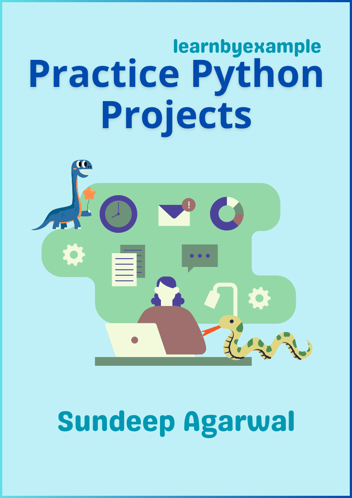

# Practice Python Projects

This book presents five beginner to intermediate level projects inspired by real world use cases:

* [Enhance your CLI experience with a custom Python calculator](https://learnbyexample.github.io/practice_python_projects/calculator/calculator.html)
* [Analyzing poll data from a Reddit comment thread](https://learnbyexample.github.io/practice_python_projects/poll_data_analysis/poll_data_analysis.html)
* [Finding typos in plain text and Markdown files](https://learnbyexample.github.io/practice_python_projects/find_typos/find_typos.html)
* [Creating a GUI for evaluating multiple choice questions](https://learnbyexample.github.io/practice_python_projects/mcq/multiple_choice_questions.html)
* [Square Tic Tac Toe — creating a GUI game with AI](https://learnbyexample.github.io/practice_python_projects/square_tic_tac_toe/square_tic_tac_toe.html)

To test your understanding and to make it more interesting, you'll also be presented with exercises at the end of each project. Resources for further exploration are also mentioned throughout the book. Visit https://youtu.be/5whwiiURWS8 for a short video about the book.

    

See [Version_changes.md](./Version_changes.md) to keep track of changes made to the book.

 

# E-book

You can purchase the pdf/epub versions of the book using these links:

* https://leanpub.com/py_projects
* https://learnbyexample.gumroad.com/l/py_projects

You can also get the book as part of these bundles:

* **The Indie Python Extravaganza** bundle from https://leanpub.com/b/theindiepythonextravaganza
    * Includes *Python 101*, *Pydon'ts*, *Python re(gex)?*, *Practice Python Projects* and *Clean Architectures in Python*
* **Learn by example Python bundle** from https://leanpub.com/b/python-bundle or https://learnbyexample.gumroad.com/l/python-bundle
* **All books bundle** bundle from https://learnbyexample.gumroad.com/l/all-books
    * Includes all my programming books

See https://learnbyexample.github.io/books/ for list of other books

For a preview of the book, see [sample chapters](https://github.com/learnbyexample/practice_python_projects/blob/main/sample_chapters/practice_python_projects_sample.pdf)

The book can also be [viewed as a single markdown file in this repo](./practice_python_projects.md). See my blogpost on [generating pdf/epub from markdown using pandoc](https://learnbyexample.github.io/customizing-pandoc/) if you are interested in the ebook creation process.

For web version of the book, visit https://learnbyexample.github.io/practice_python_projects/

 

# Feedback and Contributing

Please open an [issue](https://github.com/learnbyexample/practice_python_projects/issues) if you spot any typo/errors.

:warning: :warning: Please DO NOT submit pull requests. Main reason being any modification requires changes in multiple places.

I'd also highly appreciate your feedback about the book.

Twitter: https://twitter.com/learn_byexample

 

# Acknowledgements

* [Python documentation](https://docs.python.org/3/) — manuals and tutorials
* [/r/learnpython/](https://www.reddit.com/r/learnpython/) and [/r/Python/](https://www.reddit.com/r/Python/) — helpful forums for Python programmers
* [stackoverflow](https://stackoverflow.com/) and [unix.stackexchange](https://unix.stackexchange.com/) — for getting answers on Python, Bash and other pertinent questions 
* [tex.stackexchange](https://tex.stackexchange.com/) — for help on [pandoc](https://github.com/jgm/pandoc/) and `tex` related questions
* Cover image:
    * [Programming](https://illlustrations.co/static/69eb724751d1cc0977d48fcc5f0d8326/day93-programing.svg) illustration by [Vijay Verma](https://illlustrations.co/license/)
    * [command-window](https://www.svgrepo.com/svg/82541/command-window), [chart](https://www.svgrepo.com/svg/143589/chart), [game](https://www.svgrepo.com/svg/119527/game), [network](https://www.svgrepo.com/svg/130261/network), [question](https://www.svgrepo.com/svg/245858/question) and [snake](https://www.svgrepo.com/svg/70937/snake) icons from [svgrepo.com](https://www.svgrepo.com/page/licensing/)
    * [LibreOffice Draw](https://www.libreoffice.org/discover/draw/) — background and title/author text
* [Warning](https://commons.wikimedia.org/wiki/File:Warning_icon.svg) and [Info](https://commons.wikimedia.org/wiki/File:Info_icon_002.svg) icons by [Amada44](https://commons.wikimedia.org/wiki/User:Amada44)
* [pngquant](https://pngquant.org/) and [svgcleaner](https://github.com/RazrFalcon/svgcleaner) for optimizing images
* [Inkscape](https://inkscape.org/) for favicon
* [mdBook](https://github.com/rust-lang/mdBook) — for web version of the book
    * [mdBook-pagetoc](https://github.com/JorelAli/mdBook-pagetoc) — for adding table of contents for each page
    * [minify-html](https://github.com/wilsonzlin/minify-html) — for minifying html files

 

# License

The book is licensed under a [Creative Commons Attribution-NonCommercial-ShareAlike 4.0 International License](https://creativecommons.org/licenses/by-nc-sa/4.0/)

The code snippets are licensed under MIT, see [LICENSE](./LICENSE) file

