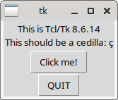

# Preface

Beginners who've finished a basic programming book or a course often wonder what they should do next. This article titled [I know how to program, but I don't know what to program](https://www.devdungeon.com/content/i-know-how-program-i-dont-know-what-program) succinctly captures the feeling.

After solving exercises that test your understanding of syntax and common logical problems, working on projects is often recommended as the next step in the programming journey.

Working on projects that'll help you solve real world use cases would be ideal. You'll likely have enough incentive to push through difficulties instead of abandoning the project. 

Sometimes though, you just don't know what to work on. Or, you have ideas, but not sure how to implement them, how to break down the project into manageable parts, etc. In such cases, a learning resource focused on projects can help.

This book presents five beginner to intermediate level projects inspired by real world use cases:

* [Enhance your CLI experience with a custom Python calculator](#cli-calculator)
* [Analyzing poll data from a Reddit comment thread](#poll-data-analysis)
* [Finding typos in plain text and Markdown files](#finding-typos)
* [Creating a GUI for evaluating multiple choice questions](#multiple-choice-questions)
* [Square Tic Tac Toe — creating a GUI game with AI](#square-tic-tac-toe)

To test your understanding and to make it more interesting, you'll also be presented with exercises at the end of each project. Resources for further exploration are also mentioned throughout the book.

## Prerequisites

You should be comfortable with Python syntax and familiar with beginner to intermediate level programming concepts. For example, you should know how to use data types like `list`, `tuple`, `dict`, `set`, etc. Features like exceptions, file processing, sorting, comprehensions, generator expressions, etc. Classes, string methods and regular expressions will also be used in this book.

If you are new to programming or Python, I'd highly recommend my [comprehensive curated list on Python](https://learnbyexample.github.io/py_resources/) to get started.

## Conventions

* The examples presented here have been tested with **Python version 3.9.5** and **GNU bash version 5.0.17**
* Code snippets that are copy pasted from the Python REPL shell have been modified for presentation purposes. For example, comments to provide context and explanations, blank lines to improve readability and so on.
* A comment with filename will be shown as the first line for program files.
* External links are provided for further exploration throughout the book. They have been chosen with care to provide more detailed resources on those topics as well as resources on related topics.
* The [practice_python_projects repo](https://github.com/learnbyexample/practice_python_projects/tree/main/programs) has all the programs presented in this book, organized by project for convenience.

## Acknowledgements

* [Python documentation](https://docs.python.org/3/) — manuals and tutorials
* [/r/learnpython/](https://www.reddit.com/r/learnpython/) and [/r/Python/](https://www.reddit.com/r/Python/) — helpful forums for Python programmers
* [stackoverflow](https://stackoverflow.com/) and [unix.stackexchange](https://unix.stackexchange.com/) — for getting answers on Python, Bash and other pertinent questions 
* [tex.stackexchange](https://tex.stackexchange.com/) — for help on [pandoc](https://github.com/jgm/pandoc/) and `tex` related questions
* Cover image:
    * [Programming](https://illlustrations.co/static/69eb724751d1cc0977d48fcc5f0d8326/day93-programing.svg) illustration by [Vijay Verma](https://illlustrations.co/license/)
    * [command-window](https://www.svgrepo.com/svg/82541/command-window), [chart](https://www.svgrepo.com/svg/143589/chart), [game](https://www.svgrepo.com/svg/119527/game), [network](https://www.svgrepo.com/svg/130261/network), [question](https://www.svgrepo.com/svg/245858/question) and [snake](https://www.svgrepo.com/svg/70937/snake) icons from [svgrepo.com](https://www.svgrepo.com/page/licensing/)
    * [LibreOffice Draw](https://www.libreoffice.org/discover/draw/) — background and title/author text
* [Warning](https://commons.wikimedia.org/wiki/File:Warning_icon.svg) and [Info](https://commons.wikimedia.org/wiki/File:Info_icon_002.svg) icons by [Amada44](https://commons.wikimedia.org/wiki/User:Amada44)
* [pngquant](https://pngquant.org/) and [svgcleaner](https://github.com/RazrFalcon/svgcleaner) for optimizing images

## Feedback and Errata

I would highly appreciate if you'd let me know how you felt about this book, it would help to improve this book as well as my future attempts. Also, please do let me know if you spot any error or typo.

Issue Manager: [https://github.com/learnbyexample/practice_python_projects/issues](https://github.com/learnbyexample/practice_python_projects/issues)

E-mail: learnbyexample.net@gmail.com

Twitter: [https://twitter.com/learn_byexample](https://twitter.com/learn_byexample)

## Author info

Sundeep Agarwal is a freelance trainer, author and mentor. His previous experience includes working as a Design Engineer at Analog Devices for more than 5 years. You can find his other works, primarily focused on Linux command line, text processing, scripting languages and curated lists, at [https://github.com/learnbyexample](https://github.com/learnbyexample). He has also been a technical reviewer for [Command Line Fundamentals](https://www.packtpub.com/application-development/command-line-fundamentals) book and video course published by Packt.

**List of books:** [https://learnbyexample.github.io/books/](https://learnbyexample.github.io/books/)

## License

This work is licensed under a [Creative Commons Attribution-NonCommercial-ShareAlike 4.0 International License](https://creativecommons.org/licenses/by-nc-sa/4.0/)

Code snippets are available under [MIT License](https://github.com/learnbyexample/practice_python_projects/blob/main/LICENSE)

Images mentioned in Acknowledgements section above are available under original licenses.

## Book version

1.0

See [Version_changes.md](https://github.com/learnbyexample/practice_python_projects/blob/main/Version_changes.md) to track changes across book versions.

# CLI Calculator

In this project, you'll learn to create a tool that can be used from a command line interface (CLI). First, you'll see how you can directly pass Python code from the command line and create `bash` shortcuts to simplify the invocation. Second, you'll see how to use Python features to create a custom CLI application. Finally, you'll be given exercises to test your understanding and resource links for further exploration. The links to these sections are given below:

* [Bash shortcuts](#bash-shortcuts)
* [Python CLI application](#python-cli-application)
* [Exercises](#exercises)

>  If you are on Windows, you can still follow along most of this project by skipping the `bash` specific portions. The CLI tool creation using `argparse` isn't tied to a specific OS. Use `py` instead of `python3.9` for program execution. See [docs.python: Windows command-line](https://docs.python.org/3/using/windows.html#from-the-command-line) and the rest of that page for more details. Alternatively, you can use [Windows Subsystem for Linux](https://en.wikipedia.org/wiki/Windows_Subsystem_for_Linux).

## Project summary

* Execute Python instructions from the command line
* Use shell shortcuts to simplify command line typing
* Evaluate string content as Python code
* Create user friendly command line interfaces
* Allow `stdin` as source of user input

The following modules and concepts will be utilized in this project:

* [docs.python: sys](https://docs.python.org/3/library/sys.html)
* [docs.python: argparse](https://docs.python.org/3/library/argparse.html)
* [docs.python: eval](https://docs.python.org/3/library/functions.html#eval)
* [docs.python: Modules](https://docs.python.org/3/tutorial/modules.html)
* [docs.python: Exception handling](https://docs.python.org/3/tutorial/errors.html)

## Real world influence

I had two main reasons to implement this project:

* learn how to write a CLI application
* a simple CLI calculator for personal use

There are powerful tools like [bc](https://en.wikipedia.org/wiki/Bc_(programming_language)) but I wanted easier syntax without fiddling with settings like `scale`. Instead of writing a shell script to customize `bc` for my use cases, I went with Python since I wanted to learn about the `argparse` module too.

## Bash shortcuts

In this section, you'll see how to execute Python instructions from the command line and use shell shortcuts to create simple CLI applications. This project uses `bash` as the shell to showcase examples.

### Python CLI options

Passing a file to the interpreter from the command line is one of the ways to execute a Python program. You can also use `-c` option to directly pass instructions to be executed as an argument. This is suitable for small programs, like getting the result of a mathematical expression. Here's an example:

```bash
# use py instead of python3.9 for Windows
$ python3.9 -c 'print(5 ** 2)'
25
```

> Use `python3.9 -h` to see all the available options. See [docs.python: Command line and environment](https://docs.python.org/3/using/cmdline.html) for documentation.

### Python REPL

If you call the interpreter without passing instructions to be executed, you'll get an interactive console known as REPL (stands for **R**ead **E**valuate **P**rint **L**oop). This is typically used to execute instructions for learning and debugging purposes. REPL is well suited to act as a calculator too. Since the result of an expression is automatically printed, you don't need to explicitly call `print()` function. A special variable `_` holds the result of the last executed expression. Here's some examples:

```bash
$ python3.9 -q
>>> 2 * 31 - 3
59
>>> _ * 2
118
>>> exit()
```

See also:

* [docs.python: Using the Python Interpreter](https://docs.python.org/3/tutorial/interpreter.html)
* [docs.python: Using Python as a Calculator](https://docs.python.org/3/tutorial/introduction.html#using-python-as-a-calculator)
* [IPython](https://ipython.readthedocs.io/en/stable/interactive/tutorial.html) — an alternate feature-rich Python REPL

### Bash function

Calling `print()` function via `-c` option from the command line is simple enough. But you could further simplify by creating a CLI application using a `bash` function as shown below.

```bash
# bash_func.sh
pc() { python3.9 -c 'print('"$1"')' ; }
```

You can type that on your current active terminal or add it your `.bashrc` file so that the shortcut is always available for use (assuming `pc` isn't an existing command). The function is named `pc` (short for Python Calculator). The first argument passed to `pc` in turn is passed along as the argument for Python's `print()` function. To see how `bash` processes this user defined function, you can use `set -x` as shown below. See [unix.stackexchange: How to debug a bash script?](https://unix.stackexchange.com/questions/155551/how-to-debug-a-bash-script) for more details.

```bash
$ set -x
$ pc '40 + 2'
+ pc '40 + 2'
+ python3.9 -c 'print(40 + 2)'
42

# don't forget to quote your argument, otherwise spaces
# and other shell metacharacters will cause issues
$ pc 40 + 2
+ pc 40 + 2
+ python3.9 -c 'print(40)'
40

$ set +x
+ set +x
```

Here's some more examples of using `pc` as a handy calculator from the command line.

```bash
$ pc '2 * 31 - 3'
59

$ pc '0xfe'
254

$ pc '76 / 13'
5.846153846153846
$ pc '76 // 13'
5
```

> See also [unix.stackexchange: when to use alias, functions and scripts](https://unix.stackexchange.com/questions/30925/in-bash-when-to-alias-when-to-script-and-when-to-write-a-function/)

### Accepting stdin

Many CLI applications allow you to pass `stdin` data as input. To add that functionality, you can use `if` statement to read a line from standard input if the number of arguments is zero or `-` character is passed as the argument. The modified `pc` function is shown below:

```bash
# bash_func_stdin.sh
pc()
{ 
    ip_expr="$1"
    if [[ $# -eq 0 || $1 = '-' ]]; then
        read -r ip_expr
    fi
    python3.9 -c 'print('"$ip_expr"')'
}
```

Here's some examples. Use `set -x` if you wish to see how the function gets evaluated for these examples.

```bash
$ source bash_func_stdin.sh

$ echo '97 + 232' | pc
329

$ echo '97 + 232' | pc -
329

$ pc '32 ** 12'
1152921504606846976
```

> See [wooledge: Bash Guide](https://mywiki.wooledge.org/BashGuide) and [ryanstutorial: Bash scripting tutorial](https://ryanstutorials.net/bash-scripting-tutorial/) if you'd like to learn more about `bash` shell scripting. See also [shellcheck](https://www.shellcheck.net/), a linting tool to avoid common mistakes and improve your script.

## Python CLI application

In this section, you'll see how to implement a CLI application using Python features, instead of relying on shell features. First, you'll learn how to work with command line arguments using the `sys` module. Followed by `argparse` module, which is specifically designed for creating CLI applications.

### sys.argv

Command line arguments passed when executing a Python program can be accessed using the `sys.argv` list. The first element (index `0`) contains the name of the Python script or `-c` or empty string, depending on how the interpreter was called. See [docs.python: sys.argv](https://docs.python.org/3/library/sys.html#sys.argv) for details.

Rest of the elements will have the command line arguments, if any were passed along the script to be executed. The data type of `sys.argv` elements is `str` class. The `eval()` function allows you to execute a string as a Python instruction. Here's an example:

```bash
$ python3.9 -c 'import sys; print(eval(sys.argv[1]))' '23 ** 2'
529

# bash shortcut
$ pc() { python3.9 -c 'import sys; print(eval(sys.argv[1]))' "$1" ; }
$ pc '23 ** 2'
529
$ pc '0x2F'
47
```

>  Using `eval()` function isn't recommended if the input passed to it isn't under your control, for example an input typed by a user from a website application. The arbitrary code execution issue would apply to the `bash` shortcuts seen in previous section as well, because the input argument is interpreted without any sanity check.
>
>However, for the purpose of this calculator project, it is assumed that you are the sole user of the application. See [stackoverflow: evaluating a mathematical expression](https://stackoverflow.com/q/2371436/4082052) for more details about the dangers of using `eval()` function and alternate ways to evaluate a string as mathematical expression.

### argparse

Quoting from [docs.python: argparse](https://docs.python.org/3/library/argparse.html):

>The `argparse` module makes it easy to write user-friendly command-line interfaces. The program defines what arguments it requires, and `argparse` will figure out how to parse those out of `sys.argv`. The `argparse` module also automatically generates help and usage messages and issues errors when users give the program invalid arguments.

### argparse initialization

If this is your first time using the `argparse` module, it is recommended to understand the initialization instructions and see the effect they provide by default. Quoting from [docs.python: argparse](https://docs.python.org/3/library/argparse.html):

>The `ArgumentParser` object will hold all the information necessary to parse the command line into Python data types.
>
>`ArgumentParser` parses arguments through the `parse_args()` method. This will inspect the command line, convert each argument to the appropriate type and then invoke the appropriate action.

```python
# arg_help.py
import argparse

parser = argparse.ArgumentParser()
args = parser.parse_args()
```

The documentation for the CLI application is generated automatically based on the information passed to the parser. You can use help options (which is added automatically too) to view the content, as shown below:

```bash
$ python3.9 arg_help.py -h
usage: arg_help.py [-h]

optional arguments:
  -h, --help  show this help message and exit
```

In addition, any option or argument that are not defined will generate an error.

```bash
$ python3.9 arg_help.py -c
usage: arg_help.py [-h]
arg_help.py: error: unrecognized arguments: -c

$ python3.9 arg_help.py '2 + 3'
usage: arg_help.py [-h]
arg_help.py: error: unrecognized arguments: 2 + 3
```

A required argument wasn't declared in this program, so there's no error for the below usage.

```bash
$ python3.9 arg_help.py
```

> See also [docs.python: Argparse Tutorial](https://docs.python.org/3/howto/argparse.html).

### Accepting an input expression

```python
# single_arg.py
import argparse, sys

parser = argparse.ArgumentParser()
parser.add_argument('ip_expr',
                    help="input expression to be evaluated")
args = parser.parse_args()

try:
    result = eval(args.ip_expr)
    print(result)
except (NameError, SyntaxError):
    sys.exit("Error: Not a valid input expression")
```

The `add_argument()` method allows you to add details about an option/argument for the CLI application. The first parameter names an argument or options (starts with `-`). The optional `help` parameter lets you add documentation for that particular option/argument. See [docs.python: add_argument](https://docs.python.org/3/library/argparse.html#argparse.ArgumentParser.add_argument) for documentation and details about other parameters.

The value for `ip_expr` passed by the user will be available as an attribute of `args`, which stores the object returned by the `parse_args()` method. The default data type for arguments is `str`, which is good enough here for `eval()`.

The help documentation for this script is shown below:

```bash
$ python3.9 single_arg.py -h
usage: single_arg.py [-h] ip_expr

positional arguments:
  ip_expr     input expression to be evaluated

optional arguments:
  -h, --help  show this help message and exit
```

Note that the script uses `try-except` block to give user friendly feedback for some of the common issues. Passing a string to `sys.exit()` gets printed to the `stderr` stream and sets the exit status as `1` to indicate something has gone wrong. See [docs.python: sys.exit](https://docs.python.org/3/library/sys.html#sys.exit) for documentation. Here's some usage examples:

```bash
$ python3.9 single_arg.py '40 + 2'
42

# if no argument is passed to the script
$ python3.9 single_arg.py
usage: single_arg.py [-h] ip_expr
single_arg.py: error: the following arguments are required: ip_expr
$ echo $?
2

# SyntaxError
$ python3.9 single_arg.py '5 \ 2'
Error: Not a valid input expression
$ echo $?
1

# NameError
$ python3.9 single_arg.py '5 + num'
Error: Not a valid input expression
```

### Adding optional flags

To add an option, use `-<char>` for short option and `--<name>` for long option. You can add both as well, `'-v', '--verbose'` for example. If you use both short and long options, the attribute name will be whichever option is the latest. For the CLI application, five short options have been added, as shown below.

```python
# options.py
import argparse, sys

parser = argparse.ArgumentParser()
parser.add_argument('ip_expr',
                    help="input expression to be evaluated")
parser.add_argument('-f', type=int,
                    help="specify floating point output precision")
parser.add_argument('-b', action="store_true",
                    help="output in binary format")
parser.add_argument('-o', action="store_true",
                    help="output in octal format")
parser.add_argument('-x', action="store_true",
                    help="output in hexadecimal format")
parser.add_argument('-v', action="store_true",
                    help="verbose mode, shows both input and output")
args = parser.parse_args()

try:
    result = eval(args.ip_expr)

    if args.f:
        result = f'{result:.{args.f}f}'
    elif args.b:
        result = f'{int(result):#b}'
    elif args.o:
        result = f'{int(result):#o}'
    elif args.x:
        result = f'{int(result):#x}'

    if args.v:
        print(f'{args.ip_expr} = {result}')
    else:
        print(result)
except (NameError, SyntaxError):
    sys.exit("Error: Not a valid input expression")
```

The `type` parameter for `add_argument()` method allows you to specify what data type should be applied for that option. The `-f` option is used here to set the precision for floating-point output. The code doesn't actually check if the output is floating-point type, that is left as an exercise for you.

The `-b`, `-o`, `-x` and `-v` options are intended as boolean data types. Using `action="store_true"` indicates that the associated attribute should be set to `False` as their default value. When the option is used from the command line, their value will be set to `True`. The `-b`, `-o` and `-x` options are used here to get the output in binary, octal and hexadecimal formats respectively. The `-v` option will print both the input expression and the evaluated result.

The help documentation for this script is shown below. By default, uppercase of the option name will be used to describe the value expected for that option. Which is why you see `-f F` here. You can use `metavar='precision'` to change it to `-f precision` instead.

```bash
$ python3.9 options.py -h
usage: options.py [-h] [-f F] [-b] [-o] [-x] [-v] ip_expr

positional arguments:
  ip_expr     input expression to be evaluated

optional arguments:
  -h, --help  show this help message and exit
  -f F        specify floating point output precision
  -b          output in binary format
  -o          output in octal format
  -x          output in hexadecimal format
  -v          verbose mode, shows both input and output
```

Here's some usage examples:

```bash
$ python3.9 options.py '22 / 7'
3.142857142857143
$ python3.9 options.py -f3 '22 / 7'
3.143
$ python3.9 options.py -f2 '32 ** 2'
1024.00

$ python3.9 options.py -bv '543 * 2'
543 * 2 = 0b10000111110

$ python3.9 options.py -x '0x1F * 0xA'
0x136

$ python3.9 options.py -o '0xdeadbeef'
0o33653337357
```

Since `-f` option expects an `int` value, you'll get an error if you don't pass a value or if the value passed isn't a valid integer.

```bash
$ python3.9 options.py -fa '22 / 7'
usage: options.py [-h] [-f F] [-b] [-o] [-x] [-v] ip_expr
options.py: error: argument -f: invalid int value: 'a'

$ python3.9 options.py -f
usage: options.py [-h] [-f F] [-b] [-o] [-x] [-v] ip_expr
options.py: error: argument -f: expected one argument

$ python3.9 options.py -f '22 / 7'
usage: options.py [-h] [-f F] [-b] [-o] [-x] [-v] ip_expr
options.py: error: argument -f: invalid int value: '22 / 7'

$ python3.9 options.py -f '22'
usage: options.py [-h] [-f F] [-b] [-o] [-x] [-v] ip_expr
options.py: error: the following arguments are required: ip_expr
```

### Accepting stdin

The final feature to be added is the ability to accept both `stdin` and argument value as the input expression. The `sys.stdin` filehandle can be used to read `stdin` data. The modified script is shown below.

```python
# py_calc.py
import argparse, sys

parser = argparse.ArgumentParser()
parser.add_argument('ip_expr', nargs='?',
                    help="input expression to be evaluated")
parser.add_argument('-f', type=int,
                    help="specify floating point output precision")
parser.add_argument('-b', action="store_true",
                    help="output in binary format")
parser.add_argument('-o', action="store_true",
                    help="output in octal format")
parser.add_argument('-x', action="store_true",
                    help="output in hexadecimal format")
parser.add_argument('-v', action="store_true",
                    help="verbose mode, shows both input and output")
args = parser.parse_args()

if args.ip_expr in (None, '-'):
    args.ip_expr = sys.stdin.readline().strip()

try:
    result = eval(args.ip_expr)

    if args.f:
        result = f'{result:.{args.f}f}'
    elif args.b:
        result = f'{int(result):#b}'
    elif args.o:
        result = f'{int(result):#o}'
    elif args.x:
        result = f'{int(result):#x}'

    if args.v:
        print(f'{args.ip_expr} = {result}')
    else:
        print(result)
except (NameError, SyntaxError):
    sys.exit("Error: Not a valid input expression")
```

The `nargs` parameter allows to specify how many arguments can be accepted with a single action. You can use an integer value to get that many arguments as a list or use specific regular expression like metacharacters to indicate varying number of arguments. The `ip_expr` argument is made optional here by setting `nargs` to `?`.

If `ip_expr` isn't passed as an argument by the user, the attribute will get `None` as the value. The `-` character is often used to indicate `stdin` as the input data. So, if `ip_expr` is `None` or `-`, the code will try to read a line from `stdin` as the input expression. The `strip()` string method is applied to the `stdin` data mainly to prevent newline from messing up the output for `-v` option. Rest of the code is the same as seen before.

The help documentation for this script is shown below. The only difference is that the input expression is now optional as indicated by `[ip_expr]`.

```bash
$ python3.9 py_calc.py -h
usage: py_calc.py [-h] [-f F] [-b] [-o] [-x] [-v] [ip_expr]

positional arguments:
  ip_expr     input expression to be evaluated

optional arguments:
  -h, --help  show this help message and exit
  -f F        specify floating point output precision
  -b          output in binary format
  -o          output in octal format
  -x          output in hexadecimal format
  -v          verbose mode, shows both input and output
```

Here's some usage examples:

```bash
# stdin from output of another command
$ echo '40 + 2' | python3.9 py_calc.py
42

# manual stdin data after pressing enter key
$ python3.9 py_calc.py
43 / 5
8.6

# strip() will remove whitespace from start/end of string
$ echo ' 0b101 + 3' | python3.9 py_calc.py -vx
0b101 + 3 = 0x8

$ echo '0b101 + 3' | python3.9 py_calc.py -vx -
0b101 + 3 = 0x8

# expression passed as argument, works the same as seen before
$ python3.9 py_calc.py '5 % 2'
1
```

### Shortcuts

To simplify calling the Python CLI calculator, you can create an alias or an executable Python script.

Use absolute path of the script to create the alias and add it to `.bashrc`, so that it will work from any working directory. The path used below would differ for you.

```bash
alias pc='python3.9 /home/learnbyexample/python_projs/py_calc.py'
```

To create an executable, you'll have to first add a [shebang](https://en.wikipedia.org/wiki/Shebang_(Unix)) as the first line of the Python script. You can use `type` built-in command to get the path of the Python interpreter.

```bash
$ type python3.9
python3.9 is /usr/local/bin/python3.9
```

So, the `shebang` for this case will be `#!/usr/local/bin/python3.9`. After adding execute permission, copy the file to one of the `PATH` directories. I have `~/cbin/` as one of the paths. See [unix.stackexchange: How to correctly modify PATH variable](https://unix.stackexchange.com/questions/26047/how-to-correctly-add-a-path-to-path) for more details about the `PATH` environment variable.

```bash
$ chmod +x py_calc.py

$ cp py_calc.py ~/cbin/pc

$ pc '40 + 2'
42
```

With that, the lessons for this project comes to an end. Solve the practice problems given in the exercises section to test your understanding.

## Exercises

Modify the scripts such that these additional features are also implemented.

* If the output is of `float` data type, apply `.2f` precision by default. This should be overridden if a value is passed along with `-f` option. Also, add a new option `-F` to turn off the default `.2f` precision.

    ```bash
    $ pc '4 / 3'
    1.33

    $ pc -f3 '22 / 7'
    3.143

    $ pc -F '22 / 7'
    3.142857142857143

    # if output isn't float, .2f shouldn't be applied
    $ pc '12 ** 12'
    8916100448256
    ```

* Use `math` module to allow mathematical methods and constants like `sin`, `pi`, etc.

    ```bash
    $ pc 'sin(radians(90))'
    1.00

    $ pc 'pi * 2'
    6.283185307179586

    $ pc 'factorial(5)'
    120
    ```

* If the input expression has a sequence of numbers followed by `!` character, replace such a sequence with the factorial value. Assume that input will not have `!` applied to negative or floating-point numbers. Or, you can issue an error if such numbers are detected.

    ```python
    $ pc '2 + 5!'
    122
    ```

* Go through [docs.python: ArgumentParser](https://docs.python.org/3/library/argparse.html#argparse.ArgumentParser) and experiment with parameters like `description`, `epilog`, etc.

### Further Reading

Python has a rich ecosystem in addition to the impressive standard library. You can find plenty of modules to choose for common tasks, including alternatives for standard modules. Check out these projects for CLI related applications.

* [click](https://pypi.org/project/click/) — Python package for creating beautiful command line interfaces in a composable way with as little code as necessary
* [Gooey](https://github.com/chriskiehl/Gooey) — turn Python command line program into a full GUI application
* [CLI Guidelines](https://clig.dev/) — an opinionated guide to help you write better CLI programs

# Poll Data Analysis

In this project, you'll learn how to use application programming interface (API) to fetch data. From this raw data, you'll extract data of interest and then apply heuristic rules to correct possible mistakes (at the cost of introducing new bugs). Finally, you'll see options to display the results.

* [Getting Reddit comments using PRAW](#getting-reddit-comments-using-praw)
* [Data cleansing](#data-cleansing)
* [Data similarity](#data-similarity)
* [Displaying results](#displaying-results)
* [Exercises](#exercises-1)

## Project summary

* Get top level comments from Reddit threads
* Use regular expressions to explore data inconsistencies and extract author names
* Correct typos by comparing similarity between names
* Display results as a word cloud

The following modules and concepts will be utilized in this project:

* [pypi: praw](https://pypi.org/project/praw/)
* [docs.python: json](https://docs.python.org/3/library/json.html)
* [Data cleansing](https://en.wikipedia.org/wiki/Data_cleansing)
* [docs.python: re](https://docs.python.org/3/library/re.html)
* [pypi: rapidfuzz](https://pypi.org/project/rapidfuzz/)
* [pypi: stylecloud](https://pypi.org/project/stylecloud/)

## Real world influence

I read a lot of fantasy novels and [/r/Fantasy/](https://www.reddit.com/r/Fantasy/) is one of my favorite social forums. They conduct a few polls every year for best novels, novellas, standalones, etc. These polls help me pick new books to read.

The poll results are manually tallied, since there can be typos, bad entries, etc. I wanted to see if this process can be automated and gave me an excuse to get familiar with using APIs and some of the third-party Python modules.

I learned a lot, especially about the challenges in data analysis. I hope you'll learn a lot too.

## Getting Reddit comments using PRAW

In this section, you'll learn to use `praw` for extracting comments from a given Reddit thread. You'll also see how to fetch only the top level comments.

From [pypi: praw](https://pypi.org/project/praw/):

>PRAW, an acronym for "Python Reddit API Wrapper", is a Python package that allows for simple access to Reddit's API. PRAW aims to be easy to use and internally follows all of Reddit's API rules. With PRAW there's no need to introduce sleep calls in your code. Give your client an appropriate user agent and you're set.

From [wikipedia: API](https://en.wikipedia.org/wiki/API):

>In computing, an application programming interface (API) is an interface that defines interactions between multiple software applications or mixed hardware-software intermediaries. It defines the kinds of calls or requests that can be made, how to make them, the data formats that should be used, the conventions to follow, etc. It can also provide extension mechanisms so that users can extend existing functionality in various ways and to varying degrees. An API can be entirely custom, specific to a component, or designed based on an industry-standard to ensure interoperability. Through information hiding, APIs enable modular programming, allowing users to use the interface independently of the implementation.

### Installation

You can install [praw](https://pypi.org/project/praw/) using the following commands: 

```bash
# virtual environment
$ pip install praw

# normal environment
# use py instead of python3.9 for Windows
$ python3.9 -m pip install --user praw
```

> I'd highly recommend using virtual environments to manage projects that use third party modules. See [Installing modules and Virtual environments](https://learnbyexample.github.io/100_page_python_intro/installing-modules-and-virtual-environments.html) chapter from my Python introduction ebook if you are not familiar with installing modules.

### Reddit app

First login to your Reddit account. Next, visit [https://www.reddit.com/prefs/apps/](https://www.reddit.com/prefs/apps/) and click the **are you a developer? create an app...** button.

For this project, using the **script** option is enough. Two of the fields are mandatory:

* name
* redirect uri

The redirect uri isn't needed for this particular project though. As mentioned in Reddit's [OAuth2 Quick Start Example](https://github.com/reddit-archive/reddit/wiki/OAuth2-Quick-Start-Example) guide, `http://www.example.com/unused/redirect/uri` can be used instead.

After filling the details, you'll get a screen with details about the app, which you can update if needed. If applicable, you'll also get an email from Reddit.

### Extracting comments

This section will give you an example of extracting comments from a particular discussion thread on Reddit. The code used is based on the [Comment Extraction and Parsing](https://praw.readthedocs.io/en/latest/tutorials/comments.html) tutorial from the documentation, which also informs that:

>If you are only analyzing public comments, entering a username and password is optional.

The sample discussion thread used here is from [the /r/booksuggestions subreddit](https://www.reddit.com/r/booksuggestions/comments/nsm98m/good_murder_mysteries_that_really_draw_you_in/). You can use this URL in the code or just the `nsm98m` id.

From the app you created in the previous section, you need to copy `client_id` and `client_secret` details. You'll find the **id** at the top of the app details (usually 14 characters) and the **secret** field is clearly marked. With those details collected, here's how you can get all the comments:

```python
>>> import praw

>>> reddit = praw.Reddit(
...     user_agent="Get Comments by /u/name",   #change 'name' to your username
...     client_id="XXX",                        #change 'XXX' to your id
...     client_secret="XXX",                    #change 'XXX' to your secret
... )

# use url keyword argument if you want to pass a link instead of id
>>> submission = reddit.submission(id='nsm98m')
>>> submission.comments.replace_more(limit=None)
[]
# only first comment output is shown here
>>> for comment in submission.comments.list():
...     print(comment.body + '\n')
... 
The Murder of Roger Ackroyd by Agatha Christie still has the
best twist I’ve ever read.
```

Use `submission.comments` instead of `submission.comments.list()` in the above `for` loop to fetch only the top level comments.

### API secrets

As mentioned in Reddit's [OAuth2 Quick Start Example](https://github.com/reddit-archive/reddit/wiki/OAuth2-Quick-Start-Example) guide:

>You should NEVER post your client secret (or your reddit password) in public. If you create a bot, you should take steps to ensure that the bot's password and the app's client secret are secured against digital theft.

To avoid accidentally revealing API secrets online (publishing your code on GitHub for example), one way is to store them in a secrets file locally. Such a secrets filename should be part of the `.gitignore` file so that it won't get committed to the GitHub repo.

## Data cleansing

Now that you know how to use `praw`, you'll start this project by getting the top level comments from two Reddit threads. These threads were used to conduct a poll about favorite speculative fiction written by women. From the raw data so obtained, author names have to be extracted. But the data format isn't always as expected. You'll use regular expressions to explore inconsistencies, remove unwanted characters from the names and ignore entries that couldn't be parsed in the format required. 

From [wikipedia: Data cleansing](https://en.wikipedia.org/wiki/Data_cleansing):

>Data cleansing or data cleaning is the process of detecting and correcting (or removing) corrupt or inaccurate records from a record set, table, or database and refers to identifying incomplete, incorrect, inaccurate or irrelevant parts of the data and then replacing, modifying, or deleting the dirty or coarse data. Data cleansing may be performed interactively with data wrangling tools, or as batch processing through scripting.

### Collecting data

The two poll threads being analyzed for this project are [2019](https://www.reddit.com/r/Fantasy/comments/cib77j/the_rfantasy_top_female_authored_works_2019/) and [2021](https://www.reddit.com/r/Fantasy/comments/m20rd1/the_rfantasy_top_books_by_women_2021_edition/). The poll asked users to specify their favorite speculative fictional books written by women, with a maximum of 10 entries. The voting comment was restricted to contain only book title and author(s). Any other discussion had to be placed under those entries as comments.

The below program builds on the example shown earlier. A `tuple` object stores the voting thread *year* and *id* values. And then a loop goes over each entry and writes only the top level comments to respective output files.

```python
# save_top_comments.py
import json
import praw

with open('.secrets/tokens.json') as f:
    secrets = json.load(f)

reddit = praw.Reddit(
    user_agent=secrets['user_agent'],
    client_id=secrets['client_id'],
    client_secret=secrets['client_secret'],
)

thread_details = (('2019', 'cib77j'), ('2021', 'm20rd1'))

for year, thread_id in thread_details:
    submission = reddit.submission(id=thread_id)
    submission.comments.replace_more(limit=None)

    op_file = f'top_comments_{year}.txt'
    with open(op_file, 'w') as f:
        for top_level_comment in submission.comments:
            f.write(top_level_comment.body + '\n')
```

The `tokens.json` file contains the information that needs to be passed to the `praw.Reddit()` method. A sample is shown below, you'll need to replace the values with your own valid information.

```bash
$ cat .secrets/tokens.json 
{
    "user_agent": "Get Comments by /u/name",
    "client_id": "XXX",
    "client_secret": "XXX"
}
```

### Data inconsistencies

As mentioned earlier, the poll asked users to specify their favorite speculative fictional books written by women, with a maximum of 10 entries. Users were also instructed to use only one entry per series, but series name or any individual book title can be specified. To analyze this data as intended, you'll have to find a way to collate all entries that fall under the same series. This is out of scope for this project. Instead, only author names will be used for the analysis, which is a significant deviation from the poll's intention.

Counting author names alone makes it easier to code this project, but you'll still come to appreciate why data cleansing is a very important step. Users were asked to write their entries as book title followed by hyphen or the word `by` and finally the author name. Assuming there is at least one whitespace character before and after the separators, here's a program that displays all the mismatching lines.

```python
import re

file = 'top_comments_2019.txt'
pat = re.compile(r'\s(?:[–-]|by)\s', flags=re.I)

with open(file) as f:
    for line in f:
        if re.fullmatch(r'\s+', line):
            continue
        elif not pat.search(line):
            print(line, end='')
```

The `re.fullmatch` regexp is used to ignore all lines containing only whitespaces. The next regexp checks if hyphen (or em dash) or `by` surrounded by whitespace characters is present in the line. Case is also ignored when `by` is matched. Matching whitespace is important because book or author name could contain `by` or hyphens. While this can still give false matches, the goal is to reduce errors as much as possible, not 100% accuracy. If a line doesn't match this condition, it will be displayed on the screen. About a hundred such lines are found in the `top_comments_2019.txt` file.

Here's a visual representation of the second regexp:


> The above railroad diagram for the `r'\s(?:[–-]|by)\s'` pattern was created using [debuggex](https://www.debuggex.com). You can also visit this [regex101 link](https://regex101.com/r/NPuLfF/1), which is another popular way to experiment and understand regexp patterns. See my [Python re(gex)?](https://learnbyexample.github.io/py_regular_expressions/) ebook if you want to learn more about regular expressions.

And here's a sample of the mismatching lines:

```abc
**Wayfarers** \- Becky Chambers
**The Broken Earth** *by N.K. Jemisin*
5. Uprooted- Naomi Novik
Empire of Sand, Tasha Suri
```

So, some votes used a slightly different markdown style and some used `,` as the separator. The first two cases can be allowed by optionally matching `\` or `*`. The last two cases will require breaking the whitespace matching rule. For now, this will be allowed so as to proceed further. But in the next section you will see how to apply regexp on a priority basis so that the different rules are applied only for mismatching lines.

The modified program is shown below. The `re.X` flag allows you to use literal whitespaces for readability purposes. You can also add comments after `#` character if you wish.

```python
# analyze.py
import re

file = 'top_comments_2019.txt'
pat = re.compile(r'''\s(?:[–-]|by)\s
                     |\s\\[–-]\s
                     |\s\*by\s
                     |[,-]\s
                  ''', flags=re.I|re.X)

with open(file) as f:
    for line in f:
        if re.fullmatch(r'\s+', line):
            continue
        elif not pat.search(line):
            print(line, end='')
```

After applying this rule, there are less than 50 mismatching lines. Some of them are comments irrelevant to the voting, but some of the entries can still be salvaged by manual modification (for example entries that have the book title and author names in reversed order). These will be completely ignored for this project, but you can try to improve as you wish.

Changing the input file to `top_comments_2021.txt` gives new kind of mismatches. Some mismatches are shown below:

```abc
The Blue Sword-Robin McKinley
**The Left Hand of Darkness**by Ursula K. Le Guin
Spinning Silver (Naomi Novik)
```

These can be accommodated by modifying the matching criteria, but since the total count of mismatches is less than 40, they will also be ignored. You can try to improve the code as an exercise. In case you are wondering, total entries are more than 1500 and 3400 for the 2019 and 2021 polls respectively. So, ignoring less than 50 mismatches isn't a substantial loss.

> Note that the results you get might be different than what is shown here due to modification of the Reddit comments under analysis. Or, users might have deleted their comments and so on.

### Extracting author names

It is time to extract only the author names and save them for further analysis. The regexp patterns seen in the previous section needs to modified to capture author names at the end of the lines. Also, `.*` is added at the start so that only the furthest match in the line is extracted. To give priority for the best case matches, the patterns are first stored separately as different elements in a `tuple`. By looping over these patterns, you can then quit once the earliest declared match is found.

```python
# extract_author_names.py
import re

ip_files = ('top_comments_2019.txt', 'top_comments_2021.txt')
op_files = ('authors_2019.txt', 'authors_2021.txt')

patterns = (r'.*\s(?:[–-]|by)\s+(.+)',
            r'.*\s\\[–-]\s+(.+)',
            r'.*\s\*by\s+(.+)',
            r'.*[,-]\s+(.+)')

for ip_file, op_file in zip(ip_files, op_files):
    with open(ip_file) as ipf, open(op_file, 'w') as opf:
        for line in ipf:
            if re.fullmatch(r'\s+', line):
                continue
            for pat in patterns:
                if m := re.search(pat, line, flags=re.I):
                    opf.write(m[1].strip('*\t ') + '\n')
                    break
```

If you check the two output files you get, you'll see some entries like shown below. Again, managing these entries is left as an exercise.

```abc
Janny Wurts & Raymond E. Feist
Patricia C. Wrede, Caroline Stevermer
Melaine Rawn, Jennifer Roberson, and Kate Elliott
and get to add some stuff I really enjoyed! In no particular order:
but:
Marie Brennan (Memoirs of Lady Trent) 
Alice B. Sheldon (as James Tiptree Jr.)
Linda Nagata from The Red trilogy 
Novik, Naomi
```

`strip('*\t ')` is applied on the captured portion to remove whitespaces at the end of the line, markdown formatting, etc. Without that, you'll get author names likes shown below:

```abc
N.K. Jemisin*
ML Wang**
*Mary Robinette Kowal
```

## Data similarity

Now that you have all the author names, the next task is to take care of typos. You'll see how to use the `rapidfuzz` module for calculating the similarity between two strings. This helps to remove majority of the typos — for example *Courtney Schaefer* and *Courtney Shafer*. But, this would also introduce new errors if similar looking names are actually different authors and not typos — for example *R.J. Barker* and *R.J. Parker*.

From [pypi: rapidfuzz](https://pypi.org/project/rapidfuzz/):

>RapidFuzz is a fast string matching library for Python and C++, which is using the string similarity calculations from [FuzzyWuzzy](https://pypi.org/project/fuzzywuzzy/).

From [pypi: fuzzywuzzy](https://pypi.org/project/fuzzywuzzy/):

>It uses [Levenshtein Distance](https://en.wikipedia.org/wiki/Levenshtein_distance) to calculate the differences between sequences in a simple-to-use package.

```bash
# virtual environment
$ pip install rapidfuzz

# normal environment
# use py instead of python3.9 for Windows
$ python3.9 -m pip install --user rapidfuzz
```

### Examples

Here's some examples of using `fuzz.ratio()` to calculate the similarity between two strings. Output of `100.0` means exact match.

```python
>>> from rapidfuzz import fuzz

>>> fuzz.ratio('Courtney Schaefer', 'Courtney Schafer')
96.96969696969697
>>> fuzz.ratio('Courtney Schaefer', 'Courtney Shafer')
93.75
```

If you decide `90` as the cut-off limit, here's some cases that will be missed.

```python
>>> fuzz.ratio('Ursella LeGuin', 'Ursula K. LeGuin')
80.0
>>> fuzz.ratio('robin hobb', 'Robin Hobb')
80.0
>>> fuzz.ratio('R. F. Kuang', 'RF Kuang')
84.21052631578948
```

Ignoring string case and removing `.` before comparing the author names helps in some cases.

```python
>>> fuzz.ratio('robin hobb'.lower(), 'Robin Hobb'.lower())
100.0
>>> fuzz.ratio('R. F. Kuang'.replace('.', ''), 'RF Kuang'.replace('.', ''))
94.11764705882354
```

Here's an example where two different authors have only a single character difference. This would result in a false positive, which can be improved if book names are also compared.

```python
>>> fuzz.ratio('R.J. Barker', 'R.J. Parker')
90.9090909090909
```

### Top authors

The below program processes the author lists created earlier.

```python
# top_authors.py
from rapidfuzz import fuzz

ip_files = ('authors_2019.txt', 'authors_2021.txt')
op_files = ('top_authors_2019.csv', 'top_authors_2021.csv')

for ip_file, op_file in zip(ip_files, op_files):
    authors = {}
    with open(ip_file) as ipf, open(op_file, 'w') as opf:
        for line in ipf:
            name = line.rstrip('\n')
            authors[name] = authors.get(name, 0) + 1

        fuzzed = {}
        for k1 in sorted(authors, key=lambda k: -authors[k]):
            s1 = k1.lower().replace('.', '')
            for k2 in fuzzed:
                s2 = k2.lower().replace('.', '')
                if round(fuzz.ratio(s1, s2)) >= 90:
                    fuzzed[k2] += authors[k1]
                    break
            else:
                fuzzed[k1] = authors[k1]

        opf.write(f'Author,votes\n')
        for name in sorted(fuzzed, key=lambda k: -fuzzed[k]):
            votes = fuzzed[name]
            if votes >= 5:
                opf.write(f'{name},{votes}\n')
```

First, a naive histogram is created with author name as key and total number of exact matches as the value.

Then, `rapidfuzz` is used to merge similar author names. The `sorted()` function is used to allow the most popular spelling to win.

Finally, the fuzzed dictionary is sorted again by highest votes and written to output files. The result is written in `csv` format with a header and a cut-off limit of minimum `5` votes.

Here's a table of top-10 authors:

| 2021 | Votes | 2019 | Votes |
| ---- | ----- | ---- | ----- |
| Ursula K. Le Guin | 139 | N.K. Jemisin | 58 |
| Robin Hobb | 127 | Ursula K. Le Guin | 57 |
| N.K. Jemisin | 127 | Lois McMaster Bujold | 52 |
| Martha Wells | 113 | Robin Hobb | 47 |
| Lois McMaster Bujold | 112 | J.K. Rowling | 47 |
| Naomi Novik | 110 | Naomi Novik | 45 |
| Susanna Clarke | 81 | Becky Chambers | 36 |
| Becky Chambers | 76 | Katherine Addison | 33 |
| Katherine Addison | 74 | Martha Wells | 30 |
| Madeline Miller | 72 | Jacqueline Carey | 29 |

If you wish to compare with the actual results, visit the threads linked below (see comment section for author name based counts). The top-10 list shown above happens to match the actual results for both the polls, but with slightly different order and vote counts.

* [2021 poll results](https://www.reddit.com/r/Fantasy/comments/n713om/rfantasys_top_books_by_women_2021_results/)
* [2019 poll results](https://www.reddit.com/r/Fantasy/comments/cp4lls/rfantasys_top_female_authored_seriesbooks_2019/)

## Displaying results

The final task is to show the results. The `csv` files generated in the previous section is good enough for most cases, but sometimes a visual display can be more appealing. In this section, you'll see how to use the `stylecloud` module for generating word clouds.

From [pypi: stylecloud](https://pypi.org/project/stylecloud/):

>Python package + CLI to generate stylistic wordclouds, including gradients and icon shapes!
>
>`stylecloud` is a Python package that leverages the popular [word_cloud](https://github.com/amueller/word_cloud) package, adding useful features to create truly unique word clouds!

```bash
# virtual environment
$ pip install stylecloud

# normal environment
# use py instead of python3.9 for Windows
$ python3.9 -m pip install --user stylecloud
```

**Note** that the `stylecloud` module depends on many other modules, so don't be surprised if you see them getting installed.

```bash
$ pip show stylecloud | grep '^Requires:'
Requires: wordcloud, icon-font-to-png, palettable, fire, matplotlib

# wordcloud in turn depends on other modules and so on
$ pip show wordcloud | grep '^Requires:'
Requires: numpy, pillow, matplotlib
```

### Word cloud

The program below is based on examples provided in the [stylecloud GitHub repo](https://github.com/minimaxir/stylecloud). The `csv` files generated earlier can be directly passed to the `file_path` argument. The second column with number of votes will be considered as **weights** for the first column data. The shape of the word cloud image generated can be specified using the `icon_name` argument. One of the *book* icons listed in the [free Font Awesome icons list](https://fontawesome.com/v5.15/icons?d=gallery&p=2&m=free) is used here.

Rest of the arguments are self explanatory. See the GitHub repo linked above for more details and customization options.

```python
# author_cloud.py
import stylecloud

ip_files = ('top_authors_2019.csv', 'top_authors_2021.csv')
op_files = ('top_authors_2019.png', 'top_authors_2021.png')

for ip_file, op_file in zip(ip_files, op_files):
    stylecloud.gen_stylecloud(file_path=ip_file,
                              icon_name='fas fa-book-open',
                              background_color='black',
                              gradient='horizontal',
                              output_name=op_file)
```

Here's the result for **2019** poll:


Here's the result for **2021** poll:


## Exercises

* Combine `extract_author_names.py` and `top_authors.py` into a single script so that the intermediate files aren't needed.
* Give your best shot at salvaging some of the vote entries that were discarded in the above scripts.
* Display a list of author names who got at least **10** votes in 2021 but less than **5** votes in 2019.
    * You'll have to fuzzy match the author names since the spelling that won could be different between the two lists.
* Find out top-5 authors who had at least **5** votes in both the lists and had the biggest gain in 2021 compared to the 2019 data. You can decide how to calculate the gain — vote count or percentage increase.

### Further Reading

* `praw`
    * [praw.readthedocs.io](https://praw.readthedocs.io/en/latest/)
    * [Authenticating via OAuth](https://praw.readthedocs.io/en/latest/getting_started/authentication.html)
    * [Comment Extraction and Parsing](https://praw.readthedocs.io/en/latest/tutorials/comments.html)
    * [/r/redditdev/](https://www.reddit.com/r/redditdev/) — subreddit for discussion of reddit API clients
    * [stackoverflow: top praw Q&A](https://stackoverflow.com/questions/tagged/praw?tab=Votes)
    * [Exploring Reddit's AMA Using the PRAW API Wrapper](https://towardsdatascience.com/exploring-reddits-ask-me-anything-using-the-praw-api-wrapper-129cf64c5d65)
    * Testing subs — [/r/test/](https://www.reddit.com/r/test/) and [/r/testingground4bots/](https://www.reddit.com/r/testingground4bots/)
* [Python re(gex)?](https://learnbyexample.github.io/py_regular_expressions/) — my ebook on Regular Expressions
* [My list of resources for Data Science and Data Analysis](https://learnbyexample.github.io/py_resources/domain.html#data-science-and-data-analysis)
* [rich](https://pypi.org/project/rich/) — library for *rich* text and beautiful formatting in the terminal

# Finding typos

In this project, you'll learn how to compare words against a dictionary to find potential typos. Two types of input format will be discussed — plain text and Markdown.

* [Plain text input](#plain-text-input)
* [Markdown input](#markdown-input)
* [Exercises](#exercises-2)

## Project summary

* Save dictionary words as a `set` data type for fast comparison
* Split input text and compare words against the dictionary set
* Scrub punctuation characters from input words and ignore case to reduce false mismatches
* Extract words from a Markdown file after removing code blocks, inline code and hyperlinks
* Handle multiple word files and recursively process all Markdown files from a given path

The following modules and concepts will be utilized in this project:

* [docs.python: string](https://docs.python.org/3/library/string.html)
* [docs.python: re](https://docs.python.org/3/library/re.html)
* [pypi: regex](https://pypi.org/project/regex/)
* [docs.python: glob](https://docs.python.org/3/library/glob.html)
* [docs.python: Generators](https://docs.python.org/3/tutorial/classes.html#generators)

## Real world influence

I started this project to help myself as a beta/gamma reader for fantasy books from the [Mage Errant](https://www.goodreads.com/series/252085-mage-errant) and [The Legends of the First Empire](https://www.goodreads.com/series/135626-the-legends-of-the-first-empire) series.

While the number of false mismatches ran into hundreds of entries, the time spent crawling through them was well worth it. I found repeated words, hard to spot typos in character names, etc. Creating reference files with series specific names and words helped reduce the mismatches for sequels.

I used the project for the Markdown files of this ebook too. Found typos like `entried`, `accomodated`, `tast` and `reponsible`.

## Plain text input

In this section, you'll see how to match each word of plain text input against a known set of words. Any input word that is not found in this set will be displayed as part of the output. You'll see how to build the reference set of words from a dictionary file and what kind of data scrubbing is needed for this task.

### Naive split

Here's a simple implementation that attempts to catch typos if input words are not present in the given dictionary file.

```python
>>> def spell_check(text):
...     return [w for w in text.split() if w not in words]
... 
>>> word_file = 'word_files/words.txt'
>>> with open(word_file) as f:
...     words = {line.rstrip() for line in f}
... 
>>> spell_check('hi there')
[]
>>> spell_check('this has a tpyo')
['tpyo']
>>> spell_check('How are you?')
['How', 'you?']
```

`set` data type uses **hash** based membership lookup, which takes constant amount of time irrespective of the number of elements (see [Hashtables](https://greenteapress.com/thinkpython2/html/thinkpython2022.html#sec255) for details). So, it is the ideal data type to store dictionary words for this project.

The input lines from the dictionary file will have line ending characters, so the `rstrip()` string method is used to remove them. You can use `strip()` method if there can be spurious whitespace characters at the start of the line as well.

The `spell_check()` function accepts a string input and returns a list of words not found in the dictionary. In this naive implementation, the input text is split on whitespaces and the resulting words are compared. As seen from the sample tests, punctuation characters and the case of input string can result in false mismatches.

> `/usr/share/dict/words` is used as `words.txt` for this project. See [wikipedia: words](https://en.wikipedia.org/wiki/Words_(Unix)) for a bit of information about the `words` file in different Linux distributions. See [linuxwords](https://users.cs.duke.edu/~ola/ap/linuxwords) if you want to view or download a smaller dictionary file for this project.

> You can use [app.aspell.net](http://app.aspell.net/create) to create dictionary files based on specific country, diacritic handling, etc.

### Data scrubbing

Here's an improved version that removes punctuation and ignores case for word comparisons:

```python
# plain_text.py
from string import punctuation

def spell_check(text):
    op = []
    for w in text.split():
        w = w.strip(punctuation)
        if w and w.lower() not in words:
            op.append(w)
    return op

word_file = 'word_files/words.txt'
with open(word_file) as f:
    words = {line.rstrip().lower() for line in f}
```

The `lower()` string method is applied for the lines of dictionary file as well as the input words. This reduces false mismatches at the cost of losing typos that are related to the case of the text.

The other major change is removing punctuation characters at the start and end of input words. Built-in `string.punctuation` is passed to the `strip()` method and the modified input words are then compared against the dictionary words.

Here's some sample test cases with this improved version:

```python
>>> from plain_text import *
>>> spell_check('hi there')
[]
>>> spell_check('this has a tpyo')
['tpyo']
>>> spell_check('How are you?')
[]
>>> spell_check('# Headery titles')
['Headery']
>>> spell_check("I'm fine. That's nothing!")
[]
```

### Unicode input

While this project assumes ASCII input for the most part, here's how you can adapt a few things for working with Unicode data. The [pypi: regex](https://pypi.org/project/regex/) module comes in handy with character sets like `\p{P}` for punctuation characters.

```python
>>> from plain_text import *
>>> text = '“Should I get this gadget?”'
>>> spell_check(text)
['“Should', 'gadget?”']
# punctuation has only ASCII characters, hence the issue
>>> [w.strip(punctuation) for w in text.split()]
['“Should', 'I', 'get', 'this', 'gadget?”']

# regex module comes in handy for Unicode punctuations
>>> import regex
>>> [regex.sub(r'^\p{P}+|\p{P}+$', '', w) for w in text.split()]
['Should', 'I', 'get', 'this', 'gadget']
```

However, unlike `string.punctuation`, the `\p{P}` set doesn't consider symbols like `>`, `+`, etc as punctuation characters. You'll have to use `\p{S}` as well to include such symbols.

```python
>>> from string import punctuation
>>> text = '"+>foo=-'
>>> text.strip(punctuation)
'foo'

>>> import regex
>>> regex.sub(r'^\p{P}+|\p{P}+$', '', text)
'+>foo='
>>> regex.sub(r'^[\p{P}\p{S}]+|[\p{P}\p{S}]+$', '', text)
'foo'
```

> If you do not want to use the `regex` module, you can build all the Unicode punctuation/symbol characters using the `unicodedata` module. See [this stackoverflow thread](https://stackoverflow.com/q/60983836/4082052) for details.

## Markdown input

In this section you'll see how to check typos for Markdown input files. A complete Markdown parser is out of scope for this project, but you'll see how a few lines of code can help to avoid code snippets and hyperlinks from being checked for typos. You'll also see how to manage multiple input files.

From [wikipedia: Markdown](https://en.wikipedia.org/wiki/Markdown):

>Markdown is a lightweight markup language for creating formatted text using a plain-text editor. John Gruber and Aaron Swartz created Markdown in 2004 as a markup language that is appealing to human readers in its source code form. Markdown is widely used in blogging, instant messaging, online forums, collaborative software, documentation pages, and readme files.

### Single Markdown file

There are different implementations of Markdown. I use GitHub Flavored Markdown, see [this Spec](https://github.github.com/gfm/) for details.

Contents of `md_files/sample.md` is shown below. Code blocks (which can span multiple lines) are specified by surrounding them with lines starting with three or more backticks. A specific programming language can be given for syntax highlighting purposes. Lines starting with `#` character(s) are headers. Inline code can be formatted by surrounding the code with backticks. Quotes start with the `>` character. Hyperlinks are created using `[link text](hyperlink)` format and so on.

````md
# re introduction

In this chapter, you'll get an introduction of `re` module  
that is part of Python's standard library.

## re.search

Use `re.search` function to tesr if the the given regexp pattern  
matches the input string. Syntax is shown below:

>`re.search(pattern, string, flags=0)`

```python
>>> sentence = 'This is a sample string'
>>> bool(re.search(r'is.*am', sentence))
True
>>> bool(re.search(r'str$', sentence))
False
```

[My book](https://github.com/learnbyexample/py_regular_expressions)  
on Python regexp has more details.

````

Writing a parser to handle complete Markdown Spec is out of scope for this project. The main aim here is to find spelling issues for normal text. That means avoiding code blocks, inline code, hyperlinks, etc. Here's one such implementation:

```python
# markdown.py
import re
from string import punctuation

def spell_check(words, text):
    for w in text.split():
        w = w.strip(punctuation + '—')
        if w and w.lower() not in words:
            yield w

def process_md(words, md_file):
    links = re.compile(r'\[([^]]+)\]\([^)]+\)')
    inline_code = re.compile(r'`[^`]+`')
    hist = {}
    code_block = False
    with open(md_file) as f:
        for line in f:
            if line.startswith('```'):
                code_block = not code_block
            elif not code_block:
                line = links.sub(r'\1', line)
                line = inline_code.sub('', line)
                for w in spell_check(words, line):
                    hist[w] = hist.get(w, 0) + 1
    return hist

if __name__ == '__main__':
    word_file = 'word_files/words.txt'
    with open(word_file) as f:
        words = {line.rstrip().lower() for line in f}

    hist = process_md(words, 'md_files/sample.md')    
    for k in sorted(hist, key=lambda k: (k.lower(), -hist[k])):
        print(f'{k}: {hist[k]}')
```

Here's explanation for the additional code compared to the plain text implementation seen earlier:

* Em dash `—` is also scrubbed as a punctuation character.
* The `words` set is passed to the `spell_check()` function as an argument instead of using global variables.
* `process_md()` function takes care of removing code blocks, hyperlinks, etc.
    * The `code_block` flag is used here to skip code blocks.
        * See [softwareengineering: FSM examples](https://softwareengineering.stackexchange.com/questions/47806/examples-of-finite-state-machines) if you are not familiar with state machines.
    * As mentioned earlier, the hyperlink formatting is `[link text](hyperlink)`. The `links` regexp `\[([^]]+)\]\([^)]+\)` handles this case. The portion between `[` and `]` characters is captured and rest of the text gets deleted.
        * You can use sites like [regex101](https://regex101.com/) and [debuggex](https://www.debuggex.com) to understand this regexp better. See my [Python re(gex)?](https://learnbyexample.github.io/py_regular_expressions/) ebook if you want to learn more about regular expressions.
    * The `inline_code` regexp `` `[^`]+` `` deletes inline code from input text.
    * After these processing steps, the remaining text is passed to the `spell_check()` function.
    * Typos (especially false mismatches) might be repeated multiple times in the given input file. So, a histogram is created here to save the potential typos as keys and their number of occurrences as values.
    * Since a dictionary data type is being used to handle the potential list of typos, the `spell_check()` function has been changed to `yield` the words one by one instead of returning a list of words.
        * See [stackoverflow: What does the yield keyword do?](https://stackoverflow.com/q/231767/4082052) if you want to know more about the `yield` keyword.
* Finally, the potential typos are displayed in alphabetical order.

```bash
$ python3.9 markdown.py
re.search: 1
regexp: 2
tesr: 1
```

Even with this narrowed version of Markdown parsing, there are cases that aren't handled properly:

* When content of the code block to be displayed can have lines starting with triple backticks, the code block markers will use more number of backticks. That's how the contents of `md_files/sample.md` was displayed above. This scenario will not be properly parsed with the above implementation.
    * As a workaround, you can save the length of backticks of the starting marker and look for ending marker with the same number of backticks.
* Similarly, inline code can have backtick characters and hyperlinks can have `()` characters. Again, this isn't handled with the above implementation.
    * You can use regexp to handle a few levels of nesting. Or, you can even implement a recursive regexp with the third party `regex` module. See [Recursive matching section](https://learnbyexample.github.io/py_regular_expressions/regex-module.html#recursive-matching) from my regexp ebook for details on both these workarounds.

### Multiple files

A project could have multiple markdown files, and they might not necessarily be all grouped together in a single directory. Another improvement that can be added is maintaining extra word files that cover false mismatches like programming terms, or even valid words that are not present in the reference dictionary file.

Here's one such implementation:

```python
# typos.py
import glob
import re
from string import punctuation

def reference_words(word_files):
    words = set()
    for word_file in word_files:
        with open(word_file) as f:
            words.update(line.rsplit(':', 1)[0].rstrip().lower() for line in f)
    return words

def spell_check(words, text):
    for w in text.split():
        w = w.strip(punctuation + '—')
        if w and w.lower() not in words:
            yield w

def process_md(words, md_file):
    links = re.compile(r'\[([^]]+)\]\([^)]+\)')
    inline_code = re.compile(r'`[^`]+`')
    hist = {}
    code_block = False
    with open(md_file) as f:
        for line in f:
            if line.startswith('```'):
                code_block = not code_block
            elif not code_block:
                line = links.sub(r'\1', line)
                line = inline_code.sub('', line)
                for w in spell_check(words, line):
                    hist[w] = hist.get(w, 0) + 1
    return hist

if __name__ == '__main__':
    word_files = glob.glob('word_files/**/*.txt', recursive=True)
    words = reference_words(word_files)

    with open('typos.log', 'w') as opf:
        for md in glob.glob('md_files/**/*.md', recursive=True):
            hist = process_md(words, md)    
            if hist:
                opf.write(f'{md}\n')
                for k in sorted(hist, key=lambda k: (k.lower(), -hist[k])):
                    opf.write(f'{k}: {hist[k]}\n')
                opf.write(f'{"-" * 50}\n\n')
```

* The `glob` module is helpful to get all the filenames that match the given wildcard expression. `*.txt` will match all files ending with `.txt` extension. If you want to match filenames from sub-directories at any depth as well, prefix the expression with `**/` and set the `recursive` parameter to `True`.
    * See [docs.python: glob](https://docs.python.org/3/library/glob.html) and [wikipedia: glob](https://en.wikipedia.org/wiki/Glob_(programming)) for more details.
* The `reference_words()` function accepts a sequence of files from which the `words` set will be built.
    * You might also notice that `rsplit()` processing has been added. This makes it easier to build extra reference files by copy pasting the false mismatches from the output of this program. Or, if you are not lazy like me, you could copy paste only the relevant string instead of whole lines and avoid this extra pre-processing step.
* The Markdown input files are also determined recursively using the `glob` module.
* The output is now formatted with a filename prefix to make it easier to find and fix the typos.

Here's a sample output with the `word_files` directory containing only the `words.txt` file:

```bash
$ python3.9 typos.py

$ cat typos.log
md_files/sample.md
re.search: 1
regexp: 2
tesr: 1
--------------------------------------------------

md_files/re/lookarounds.md
groupins: 1
lookahead: 2
lookarounds: 3
Lookarounds: 1
lookbehind: 2
--------------------------------------------------

```

Some of the terms in the above output are false mismatches. Save such lines in a separate file as shown below:

```bash
$ cat word_files/programming_terms.txt
re.search: 1
regexp: 2
lookahead: 2
lookarounds: 3
lookbehind: 2
```

Running the program again will give only the valid typos: 

```bash
$ python3.9 typos.py

$ cat typos.log
md_files/sample.md
tesr: 1
--------------------------------------------------

md_files/re/lookarounds.md
groupins: 1
--------------------------------------------------
```

### Managing word files

You can have any number of extra files to serve as word references. For example, if you are processing a text file of a novel, you might want to create a file for missing dictionary words, another for characters, yet another for fictional words, etc. That way, you can reuse specific files for future projects and this also makes it easier to manually review these files later for mistakes.

You can also speed up creating these extra files by filtering words with a minimum count, three for example. You would still have to manually review this, but it will help reduce the copy paste effort. With multiple input files, this minimum count will make more sense by maintaining a histogram of mismatches from all the input files and filtering at the end instead of per file basis.

## Exercises

* Add a function that finds whole words repeated next to other. For example, `the the` should be caught but not `his history`.
    * The `md_files/sample.md` example shown in this project already has one such issue.
* Improve the `spell_check()` function to also split entries like `with/without`. Currently it only splits on whitespace characters.
* The `typos.py` program hard codes the input directories and output filename. Modify the program to accept such data as CLI arguments. These arguments should also have a default value to make it easier to execute the program for similarly structured projects.
    * You can also use packages like [Gooey](https://github.com/chriskiehl/Gooey) to create a GUI from this CLI program.
* Change the `typos.py` program so that it works for both plain text and Markdown input files based on filename extensions.

### Further Reading

* Spell checkers and related:
    * [wikipedia: Spell checker](https://en.wikipedia.org/wiki/Spell_checker)
    * [TextBlob](https://github.com/sloria/TextBlob) — Spelling correction, splitting text into words and sentences, sentiment analysis, part-of-speech tagging, noun phrase extraction, translation, and more
    * [spylls](https://github.com/zverok/spylls) — Pure Python spell-checker, (almost) full port of Hunspell
    * [languagetool](https://github.com/languagetool-org/languagetool) — Open Source proofreading software for English and other languages
    * [proselint](https://github.com/amperser/proselint) — linter for English prose
* [Python-Markdown](https://github.com/Python-Markdown/markdown) — A Python implementation of John Gruber's Markdown with Extension support
* [Python re(gex)?](https://learnbyexample.github.io/py_regular_expressions/) — my ebook on Regular Expressions

# Multiple choice questions

In this project, you'll learn to build a [Graphical User Interface](https://en.wikipedia.org/wiki/Graphical_user_interface) (GUI) application using the `tkinter` built-in module. The task is to ask multiple choice questions, collect user answers and finally display how many questions were answered correctly. Before coding the GUI, you'll first see how to write a program to read a file containing questions and choices and implement a solution using the `input()` function. To make the task more interesting, you'll also randomize the order of questions and choices.

* [Using input function](#using-input-function)
* [Tkinter introduction](#tkinter-introduction)
* [MCQ GUI](#mcq-gui)
* [Exercises](#exercises-3)

## Project summary

* Decide a format to parse a file for questions, choices and the correct answer
* Read the file, separate out questions, choices and save the answer for reference
* Implement a solution using `input()` function
* Randomize the order of questions and choices for fun
* Learn basics of `tkinter` and understand why `class` is preferred for GUIs
* Implement a GUI application

The following modules and concepts will be utilized in this project:

* [docs.python: random](https://docs.python.org/3/library/random.html)
* [docs.python: tkinter](https://docs.python.org/3/library/tkinter.html)
* [docs.python: Classes](https://docs.python.org/3/tutorial/classes.html)

## Real world influence

I've long wanted to create an interactive GUI for programming exercises. This is already provided by many websites, but I wanted a desktop solution that can be customized.

The MCQ implementation here is just a tiny part of that idea. As the saying goes, mountains are conquered one step at a time.

## Using input function

In this section, you'll see how to read a file containing questions, choices and the answer. Then using these details, you'll use `input()` function to interactively accept user's choice for each question. At the end, you'll display how many questions were correctly answered.

Two solutions are presented in this section. First one follows the same order as present in the input file and the second one randomizes the order of questions and choices.

### File format

To be able to parse the text file, a consistent format is needed to separate out questions, choices and the correct answer for that particular question. Here's one possible structure:

```bash
# only first two question blocks are shown here
# there are total five such blocks
$ cat question_and_answers.txt
1) Which of these programming paradigms does Python support?
a) structured
b) object-oriented
c) functional
--> d) all of these choices

2) How would you specify literal characters { and } in f-strings?
--> a) {{ and }} respectively
b) \{ and \} respectively

```

Each block starts with a number, followed by `)`, a space and then the entire question in a single line. This is followed by two or more choices, with each choice on its own line. The choices start with an alphabet, followed by `)`, a space and then the text for that choice. There's only one possible answer for this implementation, marked by `--> ` at the beginning of a choice.

Exactly one empty line marks the end of a question block (including the final question block).

### Linear implementation

Here's one possible implementation that maintains the same order of questions and choices.

```python
# mcq_input.py
print('When prompted for an answer, type only the alphabet\n')

ip_file = 'question_and_answers.txt'
total_questions = 0
correct_answers = 0
with open(ip_file) as ipf:
    for line in ipf:
        if line.startswith('--> '):
            answer = line[4]
            line = line[4:]
            total_questions += 1
        print(line, end='')

        if line == '\n':
            usr_ip = input('Enter you answer: ')
            if usr_ip == answer:
                correct_answers += 1
                print('Correct answer!')
            else:
                print(f'Oops! The right choice is: {answer}')
            print('-' * 50 + '\n')

print(f'You answered {correct_answers}/{total_questions} correctly.\n')
```

Here's an overview of the logic used in the above program:

* First, inform the user that only the alphabet of the choices presented is required when prompted to answer a question
* The variables `total_questions` and `correct_answers` track how many question blocks are present in the given input file and the correct answers provided by the user respectively
* If a line starts with `--> `
    * store the answer alphabet
    * remove this indicator
    * increment the question counter
* If a line is empty,
    * ask for user's choice using the `input()` function
    * compare the user input against the answer saved earlier
    * increment the answer counter if user's choice is correct
    * also, inform the user whether the choice was correct or not
* Finally, give a summary of correct answers and total questions

Here's a sample program execution. The string `...` indicates portion that has been excluded from the output shown.

```bash
$ python3.9 mcq_input.py
When prompted for an answer, type only the alphabet

1) Which of these programming paradigms does Python support?
a) structured
b) object-oriented
c) functional
d) all of these choices

Enter you answer: d
Correct answer!
--------------------------------------------------

2) How would you specify literal characters { and } in f-strings?
a) {{ and }} respectively
b) \{ and \} respectively

Enter you answer: b
Oops! The right choice is: a
--------------------------------------------------

...

You answered 4/5 correctly.
```

### Randomizing questions and choices

The `random` module will be used here to shuffle the order of the questions and choices.

```python
# mcq_random.py
import random

print('When prompted for an answer, type only the alphabet\n')

ip_file = 'question_and_answers.txt'
question_blocks = open(ip_file).read().rstrip().split('\n\n')
random.shuffle(question_blocks)

total_questions = 0
correct_answers = 0
for block in question_blocks:
    total_questions += 1
    question, *choices = block.split('\n')
    random.shuffle(choices)
    print(f'{total_questions}) {question[question.find(" ")+1:]}')
    for choice, option in zip(choices, 'abcdefghij'):
        if choice.startswith('--> '):
            choice = choice[4:]
            answer = option
        print(f'{option}) {choice[choice.find(" ")+1:]}')

    usr_ip = input('\nEnter you answer: ')
    if usr_ip == answer:
        correct_answers += 1
        print('Correct answer!')
    else:
        print(f'Oops! The right choice is: {answer}')
    print('-' * 50 + '\n')

print(f'You answered {correct_answers}/{total_questions} correctly.\n')
```

Here's an overview of the logic used in the above program:

* The input file is assumed to be small enough to be processed as a single string
    * `rstrip()` method is used to remove excess whitespaces at the end of the file
    * `split('\n\n')` consecutive newlines is used to get the question blocks
    * these question blocks are then randomized using `random.shuffle()`
* Each question block has the question followed by choices. This is separated out by splitting on `\n` character
    * sequence unpacking is used to save the question in a string variable and choices as a list of strings
    * choice list is then randomized
* Since the questions and choices are randomized, already present question number and choice alphabet cannot be used
    * these are removed by finding the index of first space character and slicing syntax
* `total_questions` already tracks the number of questions, so this is used in place of the deleted question number
* The `zip()` function is used on the list of choices and a string of first 10 alphabets (assuming max of 10 choices) to get the choice alphabet
    * `zip()` will quit when either of the sequence reaches the end

Here's part of the output for one of the sample runs. Note that both the question and choices have been randomized.

```bash
$ python3.9 mcq_random.py
When prompted for an answer, type only the alphabet

1) How would you specify literal characters { and } in f-strings?
a) \{ and \} respectively
b) {{ and }} respectively

Enter you answer: b
Correct answer!
--------------------------------------------------

```

## Tkinter introduction

From [docs.python: Graphical User Interfaces with Tk](https://docs.python.org/3/library/tk.html):

>Tk/Tcl has long been an integral part of Python. It provides a robust and platform independent windowing toolkit, that is available to Python programmers using the tkinter package
>
>tkinter is a set of wrappers that implement the Tk widgets as Python classes

In this section, you'll see examples of **Button**, **Label** and **Radiobutton** widgets. You'll also learn how to customize some of the widget parameters and use **Frame** for organizing your widgets.

> Did you know? [IDLE](https://docs.python.org/3/library/idle.html) and [Thonny IDE](https://thonny.org/) use `tkinter` for their GUI.

> The screenshots shown here is from a Linux distribution. The appearance can vary for you, especially on Windows and MacOS.

### Built-in example

If you invoke the `tkinter` module from the command line, a sample GUI will be presented.

```bash
$ python3.9 -m tkinter
```


You can resize the window if you want to:


Go ahead, click the buttons and see what happens!

### A single Button example

Here's a small program to get started with coding a GUI with `tkinter`:

```python
# button.py
import tkinter as tk

def button_click():
    print('Button clicked!')

root = tk.Tk()
root.title('Button Click')
root.geometry('400x300')

button = tk.Button(text='Click this', command=button_click)
button.pack()

root.mainloop()
```

The main window is usually named as `root`. The `title()` method lets you set a name for the window (default is **tk** as seen in the previous example). The `geometry()` method accepts the window dimensions of the form `widthxheight+x+y` where `x` and `y` are co-ordinates. Leaving out `x` and `y` will usually place the window at the center of your screen.

The `tk.Button()` method helps you create a button. The `command` parameter lets you define the action to be taken when that particular button is clicked. In this example, the function simply prints something to your normal `stdout` screen.


```bash
$ python3.9 button.py
Button clicked!
Button clicked!
```

After creating the button, you can use methods like `pack()` and `grid()` to control its placement. More details will be discussed later.

The `mainloop()` method is the preferred way to block the Python program from exiting (see what happens if you don't have this line). The user can then interact with the window as needed. Note that this example doesn't explicitly provide a widget to exit the window. Depending on your OS and desktop environment, you can use the window close options (usually on the top left and/or top right).

> You can also pass [lambda expressions](https://docs.python.org/3/tutorial/controlflow.html#lambda-expressions) to the `command` parameter. `lambda` is also helpful if the function to be called requires arguments.

> See [this stackoverflow Q&A thread](https://stackoverflow.com/q/29158220/4082052) for more details about the `mainloop()` method.

### Adding a Label

The below program extends the previous example by adding two more widgets:

* a Label widget to display information
* a Button widget to exit the window

```python
# buttons_and_labels.py
import tkinter as tk

def button_click():
    label['text'] = 'Button clicked!'
    label['fg'] = 'blue'

def quit_program():
    root.destroy()

root = tk.Tk()
root.title('Buttons and Labels')
root.geometry('400x300')

label = tk.Label(text='Click the button', pady=10)
label.pack()

button = tk.Button(text='Click this', command=button_click)
button.pack(side=tk.LEFT)

quit = tk.Button(text='Quit', command=quit_program)
quit.pack(side=tk.RIGHT)

root.mainloop()
```

The two buttons are placed next to each other by using the `side` parameter. By default, they would have been stacked vertically (as is the case here for the Label widget). As seen in the screenshot below, the layout is bad though. You'll see how Frame helps in a later example.

You can change the parameters similar to using `dict` keys on the variable that points to the widget object. `fg` parameter controls the foreground color. `pady` parameter controls the vertical spacing around the widget.

The `destroy()` method can be called on any widget, including the main window. In addition to the quit button, the user can still use window close options mentioned earlier. See this [stackoverflow thread](https://stackoverflow.com/q/111155/4082052) if you want to handle those window close events yourself.


But first, this program will be re-written using `class` instead of using functions and global variables. A GUI program usually requires widgets to refer to each other, which gets difficult to handle without using `class`.

```python
# class_example.py
import tkinter as tk

class Root(tk.Tk):
    def __init__(self):
        super().__init__()

        self.title('Buttons and Labels')
        self.geometry('400x300')

        self.label = tk.Label(text='Click the button', pady=10)
        self.label.pack()

        self.button = tk.Button(text='Click this', command=self.button_click)
        self.button.pack(side=tk.LEFT)

        self.quit = tk.Button(text='Quit', command=self.quit_program)
        self.quit.pack(side=tk.RIGHT)

    def button_click(self):
        self.label['text'] = 'Button clicked!'
        self.label['fg'] = 'blue'

    def quit_program(self):
        self.destroy()

root = Root()
root.mainloop()
```

### Frame

To improve the layout of the previous example, here's a modified version with Frame:

```python
# frames.py
import tkinter as tk

class Root(tk.Tk):
    def __init__(self):
        super().__init__()

        self.title('Frames')
        self.geometry('400x300')

        self.frame = tk.Frame()
        self.frame.pack(expand=True)

        self.label = tk.Label(self.frame, text='Click the button', pady=10)
        self.label.pack()

        self.button = tk.Button(self.frame, text='Click this',
                                command=self.button_click)
        self.button.pack(side=tk.LEFT)

        self.quit = tk.Button(self.frame, text='Quit',
                              command=self.quit_program)
        self.quit.pack(side=tk.RIGHT)

    def button_click(self):
        self.label['text'] = 'Button clicked!'
        self.label['fg'] = 'blue'

    def quit_program(self):
        self.destroy()

if __name__ == '__main__':
    root = Root()
    root.mainloop()
```

To add a widget to a particular Frame instead of the main window, pass the frame variable when you create that widget. The `expand=True` parameter for packing will give unassigned window area to the frame, thus resulting in centered buttons and labels in this particular example.


> See [this stackoverflow Q&A thread](https://stackoverflow.com/q/28089942/4082052) for more details about `expand` and `fill` parameters.

### Radio buttons

The final example in this introduction section uses Radiobutton widget.

```python
# radio_buttons.py
import tkinter as tk

class Root(tk.Tk):
    def __init__(self):
        super().__init__()

        self.title('Radio Buttons')
        self.geometry('400x300')

        self.frame = tk.Frame()
        self.frame.pack(expand=True)

        self.label = tk.Label(self.frame, pady=10)
        self.label.pack()

        rb = tk.IntVar()
        choices = (('False', 1), ('True', 2))
        for choice, idx in choices:
            tk.Radiobutton(self.frame, text=choice, value=idx, variable=rb,
                           command=lambda: self.label.config(text=rb.get()),
                          ).pack(anchor=tk.W)

if __name__ == '__main__':
    root = Root()
    root.mainloop()
```

The `value` parameter for the Radiobutton here assigns an integer for that particular choice. This integer value associated with a choice will be assigned to the variable that you pass to the `variable` parameter. Integer value is used in this example, so you need to pass a `IntVar()` object.

The `anchor` parameter here places the radio buttons on the west side of the frame (default is center) relative to other widgets. This effect will be more visible in the multiple choice GUI presented in the next section.

When the user selects a choice, the integer associated with that choice is fetched using the `get()` method. The `config()` method is another way to change a widget's parameters, helpful when you are using `lambda` expressions. In this case, the label's `text` parameter is modified.


> See [tkdocs: Control variables](https://tkdocs.com/shipman/control-variables.html) and [tkdocs: anchors](https://tkdocs.com/shipman/anchors.html) for more details about `IntVar()` and `anchor` parameter respectively.

> See [tkdocs: Basic Widgets](https://tkdocs.com/tutorial/widgets.html) for more details about all the widgets introduced in this section as well as other widgets not discussed here.

## MCQ GUI

In this section, you'll implement a GUI for evaluating multiple choice questions. This will reuse some of the code already presented in earlier sections. The main change from `input()` function implementation is that the user can select and change their choice as many times as they want. The answer would be recorded only when a button is clicked. Another difference is that the questions are asked one at a time, easier to implement here since you have total control over the display screen.

### Code and explanations

Here's one possible implementation:

```python
# mcq_gui.py
import tkinter as tk
import random

class Root(tk.Tk):
    def __init__(self, question_blocks):
        super().__init__()

        self.question_blocks = question_blocks
        self.q_total = len(self.question_blocks)
        self.q_count = 1
        self.a_count = 0
        self.title('Multiple Choice Questions')
        self.geometry('400x300')
        self.create_frame()

    def create_frame(self):
        self.frame = tk.Frame()
        self.frame.pack(expand=True)

        self.l_ask = tk.Label(self.frame, wraplength=300, justify='left',
                              fg='brown', pady=10, font='TkFixedFont')
        self.l_ask.pack()

        self.create_radio()

        self.l_info = tk.Label(self.frame, pady=10)
        self.l_info.pack()

        self.b_submit = tk.Button(self.frame, text='Submit',
                                  state='disabled', command=self.submit)
        self.b_submit.pack(side=tk.LEFT)
        self.submit_clicked = False

        self.b_next = tk.Button(self.frame, text='Next',
                                state='disabled', command=self.next)
        self.b_next.pack(side=tk.RIGHT)

    def create_radio(self):
        self.radio_choice = tk.IntVar()
        self.radio_choice.set(0)
        question, *choices = self.question_blocks[self.q_count-1].split('\n')
        random.shuffle(choices)
        self.l_ask['text'] = f'{self.q_count}) {question[question.find(" ")+1:]}'
        for idx, self.choice in enumerate(choices, 1):
            if self.choice.startswith('--> '):
                self.choice = self.choice[4:]
                self.answer = idx
            self.choice = self.choice[self.choice.find(" ")+1:]
            tk.Radiobutton(self.frame, text=self.choice, font='TkFixedFont',
                           padx=20, variable=self.radio_choice, value=idx,
                           command=self.radio).pack(anchor=tk.W)

    def radio(self):
        if not self.submit_clicked:
            self.b_submit['state'] = 'normal'

    def submit(self):
        self.submit_clicked = True
        usr_ip = self.radio_choice.get()
        if usr_ip == self.answer:
            self.a_count += 1
            self.l_info['fg'] = 'green'
            self.l_info['text'] = 'Correct answer! \U0001F44D'
        else:
            self.l_info['fg'] = 'red'
            self.l_info['text'] = ('\u274E Oops! '
                                   f'The right choice is: {self.answer}')
        self.b_submit['state'] = 'disabled'
        self.b_next['state'] = 'normal'

    def next(self):
        self.frame.destroy()
        self.q_count += 1
        if self.q_count <= self.q_total:
            self.create_frame()
        else:
            self.frame = tk.Frame()
            self.frame.pack(expand=True)
            report = f'You answered {self.a_count}/{self.q_total} correctly'
            self.l_report = tk.Label(self.frame, fg='blue', text=report)
            self.l_report.pack()

if __name__ == '__main__':
    ip_file = 'question_and_answers.txt'
    question_blocks = open(ip_file).read().rstrip().split('\n\n')
    random.shuffle(question_blocks)

    root = Root(question_blocks)
    root.mainloop()
```

Most of the widget creation and code logic should be familiar to you from the previous sections. Here's some details specific to this program:

* `wraplength` is used to force a long question into multiple lines.
* `TkFixedFont` (monospace) is used because there are code snippets in some of the questions and answers.
* The `Submit` and `Next` buttons are initially in the `state='disabled'` option. After the user selects one of the choices, the state is changed to `normal` for the `Submit` button.
* To prevent the user from submitting an answer multiple times, a flag is used.
* Once an answer is submitted, the state is changed to `normal` for the `Next` button.
* When the `Next` button is clicked, the current frame is destroyed. If there are pending questions, they are displayed and the process repeats. Else, a final frame shows the report card.

### Screenshots

Here's some screenshots:


## Exercises

* Change the window icon, you can use [this stackoverflow thread](https://stackoverflow.com/q/33137829/4082052) for reference.
* Read this [tkdocs: Grid Geometry Manager](https://tkdocs.com/tutorial/grid.html) tutorial and redo the final GUI program `mcq_gui.py` using `grid()` instead of the `pack()` method.
* Read this [tkdocs: Styles and Themes](https://tkdocs.com/tutorial/styles.html) tutorial and [docs.python: tkinter.ttk](https://docs.python.org/3/library/tkinter.ttk.html) to experiment with changing the appearance of your GUI programs.
* Read this [tkdocs: Checkbutton](https://tkdocs.com/tutorial/widgets.html#checkbutton) tutorial and implement a solution for cases requiring multiple choices to be selected for a given question.
* Implement `mcq_gui.py` without using classes if you are still not convinced that OOP is better for GUI applications.

### Further Reading

* [tkdocs](https://tkdocs.com/index.html) — tutorials, best practices and more
* [wiki.python: TkInter](https://wiki.python.org/moin/TkInter) — learning resources, extensions, etc
* [ttk themes](https://github.com/rdbende/Sun-Valley-ttk-theme)
* [Python GUI Programming With Tkinter](https://realpython.com/python-gui-tkinter/)
* [stackoverflow: Best way to structure a tkinter application](https://stackoverflow.com/q/17466561/4082052)
* [My list of resources for GUI and Games](https://learnbyexample.github.io/py_resources/domain.html#gui-and-games)

# Square Tic Tac Toe

In this project, you'll create a game GUI as well as see how you can program an Artificial Intelligence (AI) that makes smart moves. While `tkinter` is not typically suited for creating game GUIs, this project is simple enough to manage with basic widgets and layouts.

[Tic Tac Toe](https://en.wikipedia.org/wiki/Tic-tac-toe) (also known as **noughts and crosses**) is a popular choice for a beginner project. In this two player turn based game on a 3x3 board, the aim is to form a line with three consecutive cells in any direction — horizontal, vertical or diagonal.

To make it more interesting and challenging, you'll also extend the game to aim for a square on a 4x4 board. To begin with, the computer will make random moves. Later, you'll use a weight based algorithm to program a smarter game AI.

* [Grid layout and images](#grid-layout-and-images)
* [Tic Tac Toe GUI](#tic-tac-toe-gui)
* [Square Tic Tac Toe GUI](#square-tic-tac-toe-gui)
* [Square Tic Tac Toe AI](#square-tic-tac-toe-ai)
* [Exercises](#exercises-4)

## Project summary

* Learn to use `grid()` layout
* Create clickable `Label` with image background
* Implement GUI for the Tic Tac Toe game
* Make minimal changes to the Tic Tac Toe GUI so that the players have to form a square on a 4x4 board
* Program a game AI using weight based algorithm

The following modules and concepts will be utilized in this project:

* [docs.python: random](https://docs.python.org/3/library/random.html)
* [docs.python: tkinter](https://docs.python.org/3/library/tkinter.html)
* [docs.python: Classes](https://docs.python.org/3/tutorial/classes.html)
* [Artificial intelligence in games](https://en.wikipedia.org/wiki/Artificial_intelligence_in_video_games)

## Real world influence

Square Tic Tac Toe holds a special place for me. I first came up with this tweak to the classic game in high school. For a competition in college, my friends and I implemented the game with multicolor LEDs. That was my first attempt at writing a game AI. A few more years later, I made an Android game out of this concept.

And now, I'm using it again as one of the projects for this ebook.

## Grid layout and images

In an earlier project, you saw how to use the `pack()` method to manage layout of widgets. In this section, you'll see how to use the `grid()` method. As the name implies, this method helps to place widgets in a regular fashion based on horizontal and vertical values.

> The [Multiple choice questions](#multiple-choice-questions) project is a prerequisite for this project, specifically the lessons about the `tkinter` module.

### Grid layout

Here's an example of placing nine buttons in a 3x3 grid.

```python
# grid_layout.py
import random
import tkinter as tk

class Root(tk.Tk):
    def __init__(self):
        super().__init__()

        self.title('Grid Layout')
        self.geometry('200x200')

        self.frame = tk.Frame()
        self.frame.pack(expand=True)

        self.button = [None] * 9
        for i in range(9):
            r, c = divmod(i, 3)
            self.button[i] = tk.Button(self.frame, text=' ', font='TkFixedFont',
                                       command=lambda n=i: self.button_click(n))
            self.button[i].grid(row=r, column=c)

    def button_click(self, n):
        choice = random.randrange(2)
        character, color = (('x', 'red'), ('o', 'green'))[choice]
        self.button[n]['text'] = character
        self.button[n]['fg'] = color

if __name__ == '__main__':
    root = Root()
    root.mainloop()
```

* The `divmod()` function gives you both the quotient and the remainder. Helpful here to assign row and column for a particular button. 
* As mentioned before, `lambda` expression helps when you need to pass arguments to the command function. Needed here because a single function handles click event for all of the buttons.
* The click function randomly sets one of the two characters. To avoid the layout from changing due to difference in button text, monospace font is used. The default is single space character (which is invisible on the screen) and valid characters are `x` and `o`.


> See [tkdocs: grid](https://tkdocs.com/tutorial/grid.html) for more details.

### Image Labels

By default, a button widget changes appearance based on whether it is held down, mouse is hovering over it, etc. This works well for cases where a button can be clicked multiple times, but not for a single click requirement in a game. For example, after a particular button is clicked on the game board, there should be no more effects since that button cannot be clicked again. You cannot use `disabled` state, since it will grey out the button.

You can programmatically handle those button events so that it behaves as you want. Adding click functionality to a label widget is far easier. The downside is that you'll need to add code for changing appearance of a label if is held down, etc. That is left as an exercise for you.

Here's an example of using images for labels and adding click event for these labels.

```python
# image_labels.py
import random
import tkinter as tk

class Root(tk.Tk):
    def __init__(self):
        super().__init__()

        self.title('Image Labels')
        self.geometry('200x200')

        self.frame = tk.Frame()
        self.frame.pack(expand=True)

        self.char_x = tk.PhotoImage(file='./char_x.png')
        self.char_o = tk.PhotoImage(file='./char_o.png')
        self.empty = tk.PhotoImage()

        self.label = [None] * 9
        self.last_click = 0
        for i in range(9):
            r, c = divmod(i, 3)
            self.label[i] = tk.Label(self.frame, image=self.empty,
                                     highlightthickness=1,
                                     width=50, height=50, bg='white')
            self.label[i].bind('<Button-1>',
                               lambda e, n=i: self.button_click(e, n))
            self.label[i].grid(row=r, column=c)

    def button_click(self, e, n):
        self.label[self.last_click]['bg'] = 'white'
        self.last_click = n
        choice = random.randrange(2)
        self.label[n]['image'] = (self.char_x, self.char_o)[choice]
        self.label[n]['bg'] = ('orange', 'grey')[choice]

if __name__ == '__main__':
    root = Root()
    root.mainloop()
```

* The `bind()` method allows you to handle that particular event. `<Button-1>` event handles left click of the mouse. The specified event gets passed as the first argument to the command function, so the label index is passed as the second argument.
* The `highlightthickness` parameter specifies the area surrounding the widget. By default, this is `0` for labels and `1` for buttons. By setting this parameter to `1` and changing the background, you'll get the desired grid with a visible separator between the cells.
    * You can use the `highlightbackground` parameter to change the color of this area.
* Clicking anywhere on these labels will randomly set one of the two images. The background color is also changed, so that you can keep track of which label was clicked most recently.
* The `tk.PhotoImage()` method helps here to process [PNG](https://en.wikipedia.org/wiki/Portable_Network_Graphics) image files. 
    * When no file is passed, `tk.PhotoImage()` creates an empty image. Used here to initialize the labels.
* `width` and `height` parameters are used to set the size of the label.


**Note** that PNG support was added recently. From [tkdocs: images](https://tkdocs.com/tutorial/fonts.html#images):

>Out of the box, Tk 8.5 includes support for GIF and PPM/PNM images. Tk 8.6 added PNG to this short list. However, there is a Tk extension library called Img, which adds support for many others: BMP, XBM, XPM, JPEG, PNG (if you're using 8.5), TIFF, etc. Though not included directly in the Tk core, Img is usually included with other packaged distributions (e.g., ActiveTcl).

If you don't have PNG support, you can use [pypi: Pillow](https://pypi.org/project/Pillow/) instead:

```python
from PIL import ImageTk, Image
image = ImageTk.PhotoImage(Image.open('image.png'))
```

## Tic Tac Toe GUI

This section will show how to create a GUI for Tic Tac Toe using `tkinter`. User will play against the computer. To keep it simple, computer moves will be just a random selection. Smarter computer move will be discussed in a later section.

### Layout

There are several ways to prepare before you start coding your GUI. Creating a rough sketch of how your GUI should look with pen and paper is often recommended. Here's one possible list of requirements:

* Options to choose who moves first
* Quit (close the window, optional)
* Start a game/play again
* Display information about the current game status
* The game board

Both `grid()` and `pack()` layout techniques will be used here. You cannot mix different layout methods, but you can use different frames to group and isolate widgets based on layout requirements.

### Code

```python
# tic_tac_toe.py
import random
import tkinter as tk

class Root(tk.Tk):
    def __init__(self):
        super().__init__()

        self.title('Tic Tac Toe')
        self.geometry('500x400')

        self.char_x = tk.PhotoImage(file='./char_x.png')
        self.char_o = tk.PhotoImage(file='./char_o.png')
        self.empty = tk.PhotoImage()

        self.active = 'GAME ACTIVE'
        self.total_cells = 9
        self.line_size = 3
        self.computer = {'value': 1, 'bg': 'orange',
                         'win': 'COMPUTER WINS', 'image': self.char_x}
        self.user = {'value': self.line_size+1, 'bg': 'grey',
                     'win': 'USER WINS', 'image': self.char_o}
        self.board_bg = 'white'
        self.all_lines = ((0, 1, 2), (3, 4, 5), (6, 7, 8),
                          (0, 3, 6), (1, 4, 7), (2, 5, 8),
                          (0, 4, 8), (2, 4, 6))

        self.create_radio_frame()
        self.create_control_frame()

    def create_radio_frame(self):
        self.radio_frame = tk.Frame()
        self.radio_frame.pack(side=tk.TOP, pady=5)

        tk.Label(self.radio_frame, text='First Move').pack(side=tk.LEFT)
        self.radio_choice = tk.IntVar()
        self.radio_choice.set(self.user['value'])
        tk.Radiobutton(self.radio_frame, text='Computer',
                       variable=self.radio_choice, value=self.computer['value']
                      ).pack(side=tk.LEFT)
        tk.Radiobutton(self.radio_frame, text='User',
                       variable=self.radio_choice, value=self.user['value']
                      ).pack(side=tk.RIGHT)

    def create_control_frame(self):
        self.control_frame = tk.Frame()
        self.control_frame.pack(side=tk.TOP, pady=5)

        self.b_quit = tk.Button(self.control_frame, text='Quit',
                                command=self.quit)
        self.b_quit.pack(side=tk.LEFT)

        self.b_play = tk.Button(self.control_frame, text='Play',
                                command=self.play)
        self.b_play.pack(side=tk.RIGHT)

    def create_status_frame(self):
        self.status_frame = tk.Frame()
        self.status_frame.pack(expand=True)

        tk.Label(self.status_frame, text='Status: ').pack(side=tk.LEFT)
        self.l_status = tk.Label(self.status_frame)
        self.l_status.pack(side=tk.RIGHT)

    def create_board_frame(self):
        self.board_frame = tk.Frame()
        self.board_frame.pack(expand=True)

        self.cell = [None] * self.total_cells
        self.board = [0] * self.total_cells
        self.remaining_moves = list(range(self.total_cells))
        for i in range(self.total_cells):
            self.cell[i] = tk.Label(self.board_frame, highlightthickness=1,
                                    width=75, height=75, bg=self.board_bg,
                                    image=self.empty)
            self.cell[i].bind('<Button-1>',
                              lambda e, move=i: self.user_click(e, move))
            r, c = divmod(i, self.line_size)
            self.cell[i].grid(row=r, column=c)

    def play(self):
        self.b_play['state'] = 'disabled'
        if self.b_play['text'] == 'Play':
            self.create_status_frame()
            self.b_play['text'] = 'Play Again'
        else:
            self.board_frame.destroy()
        self.l_status['text'] = self.active
        self.state = self.active
        self.last_click = 0
        self.create_board_frame()
        if self.radio_choice.get() == self.computer['value']:
            self.computer_click()

    def quit(self):
        self.destroy()

    def user_click(self, e, user_move):
        if self.board[user_move] != 0 or self.state != self.active:
            return
        self.update_board(self.user, user_move)
        if self.state == self.active:
            self.computer_click()

    def computer_click(self):
        computer_move = random.choice(self.remaining_moves)
        self.update_board(self.computer, computer_move)

    def update_board(self, player, move):
        self.board[move] = player['value']
        self.remaining_moves.remove(move)
        self.cell[self.last_click]['bg'] = self.board_bg
        self.last_click = move
        self.cell[move]['image'] = player['image']
        self.cell[move]['bg'] = player['bg']
        self.update_status(player)
        self.l_status['text'] = self.state
        if self.state != self.active:
            self.b_play['state'] = 'normal'

    def update_status(self, player):
        winner_sum = self.line_size * player['value']
        for line in self.all_lines:
            if sum(self.board[i] for i in line) == winner_sum:
                self.state = player['win']
                self.highlight_winning_line(player, line)
        if self.state == self.active and not self.remaining_moves:
            self.state = 'TIE'

    def highlight_winning_line(self, player, line):
        for i in line:
            self.cell[i]['bg'] = player['bg']

if __name__ == '__main__':
    root = Root()
    root.mainloop()
```

### Explanation for frames

* Initial screen shows two frames at the top — radio and control.
    * User gets to play the first move by default, which can be changed by choosing the `Computer` option.
    * `Quit` button is active all the time, allows the user to close the application.
    * `Play` button is responsible for creating a new game. After the first click, the text changes to `Play Again`.
* The status frame holds two labels to indicate the current state of the game. This becomes visible when the `Play` button is clicked.
    * There are three states — `GAME ACTIVE`, `TIE` and victory for one of the players (`COMPUTER WINS` or `USER WINS`).
* The board frame creates the grid of labels representing the game area. This becomes visible when the `Play` button is clicked.
    * Left button click for each cell is handled by the `user_click()` method.

The `side=tk.TOP` option sets the top position for radio and control frames. This is chosen since the other two frames are created only after the `Play` button is clicked. If you prefer, you can choose to add a help text about the game rules when the application is first launched.

### Explanation for variables

* `state` tracks the current state of the game. You could technically use the `text` parameter of the status label as well, but separate variable will help if you want to split the code into separate classes for game logic and UI.
* `total_cells` and `line_size` don't have much use in this particular code, but it will help if you want to extend the game to support multiple board sizes.
* `computer` and `user` dictionaries store player information. This allows methods like `update_board()` to work for both players based on which dictionary is passed as an argument.
* `all_lines` stores indexes of all valid lines (8 lines in total for 3x3 board).
* `remaining_moves` list keeps track of available moves. Whenever a user/computer move is made, that particular index is removed from this list.
* `board` list keeps track of which player has made a move for a particular cell using the `value` key from the player's respective dictionary.
    * `cell` list is the equivalent for image labels.
* `last_click` keeps track of which cell was last updated. Since there is no delay implemented for computer moves in this code, effectively you'll see only the last computer move highlighted. The only exception is if a game ends in a `TIE` and the last move was made by the user.

### Explanation for game logic

* Once the user clicks the `Play` button, the status and board frames show up.
    * Initial status shows game in active state.
    * For `Play Again` button, the old board frame is destroyed before creating the new board.
    * If `Computer` plays first was chosen, one computer move is made.
* All computer moves are random in this particular project. Coding a smarter move will be discussed later.
* When the user clicks one of the image labels:
    * `return` without further processing if the game is not active or if a valid move is already made on that cell.
    * Otherwise, the board is updated using the `update_board()` method.
    * Then, if the game is still active, another computer move is made.
* `update_board()` method:
    * Based on the player dictionary and move index passed, the `board`, `cell`, `last_click` and `remaining_moves` variables are updated.
    * Once the move is completed, status is updated. If the game is no longer active, `Play Again` button's state is changed to `normal`.
* `update_status()` method:
    * Game ends if one of the player wins or if all the cells have been clicked (resulting in a `TIE`).
    * Iterate over the `all_lines` tuple and calculate the sum of values of each index from a particular line.
        * If the sum equals 3 (i.e. `line_size`) times the player value, then it is a winning line.
        * `highlight_winning_line` method will highlight such a line by changing the background of all indexes for this line.
        * Note that there can be multiple winning lines.

### Screenshots


## Square Tic Tac Toe GUI

In the previous section you saw how to create a Tic Tac Toe GUI. In this section you'll see how to tweak that code to create a game with different rules. Instead of a line, a square should be formed using four corners.

### How it differs from Tic Tac Toe

In Tic Tac Toe, a player wins by forming a line with three consecutive cells in any direction — horizontal, vertical or diagonal. In this modified version, a player has to form a square, i.e. four cells forming 90 degree angles and equidistant from each other.

A 3x3 grid would be too small a playing area, so 4x4 grid is used instead. Compared to 8 possible lines in Tic Tac Toe, this version has 20 possible squares. Can you spot all of them? Here's an illustration to help you:


### Code

```python
# square_tic_tac_toe.py
import random
import tkinter as tk

class Root(tk.Tk):
    def __init__(self):
        super().__init__()

        self.title('Square Tic Tac Toe')
        self.geometry('500x400')

        self.char_x = tk.PhotoImage(file='./char_x.png')
        self.char_o = tk.PhotoImage(file='./char_o.png')
        self.empty = tk.PhotoImage()

        self.active = 'GAME ACTIVE'
        self.total_cells = 16
        self.corners = 4
        self.computer = {'value': 1, 'bg': 'orange',
                         'win': 'COMPUTER WINS', 'image': self.char_x}
        self.user = {'value': self.corners+1, 'bg': 'grey',
                     'win': 'USER WINS', 'image': self.char_o}
        self.board_bg = 'white'
        self.all_squares = ((0, 1, 4, 5), (1, 2, 5, 6), (2, 3, 6, 7),
                            (4, 5, 8, 9), (5, 6, 9, 10), (6, 7, 10, 11),
                            (8, 9, 12, 13), (9, 10, 13, 14), (10, 11, 14, 15),
                            (0, 2, 8, 10), (1, 3, 9, 11), (4, 6, 12, 14),
                            (5, 7, 13, 15), (0, 3, 12, 15), (1, 4, 6, 9),
                            (2, 5, 7, 10), (5, 8, 10, 13), (6, 9, 11, 14),
                            (1, 7, 8, 14), (2, 4, 11, 13))

        self.create_radio_frame()
        self.create_control_frame()

    def create_radio_frame(self):
        self.radio_frame = tk.Frame()
        self.radio_frame.pack(side=tk.TOP, pady=5)

        tk.Label(self.radio_frame, text='First Move').pack(side=tk.LEFT)
        self.radio_choice = tk.IntVar()
        self.radio_choice.set(self.user['value'])
        tk.Radiobutton(self.radio_frame, text='Computer',
                       variable=self.radio_choice, value=self.computer['value']
                      ).pack(side=tk.LEFT)
        tk.Radiobutton(self.radio_frame, text='User',
                       variable=self.radio_choice, value=self.user['value']
                      ).pack(side=tk.RIGHT)

    def create_control_frame(self):
        self.control_frame = tk.Frame()
        self.control_frame.pack(side=tk.TOP, pady=5)

        self.b_quit = tk.Button(self.control_frame, text='Quit',
                                command=self.quit)
        self.b_quit.pack(side=tk.LEFT)

        self.b_play = tk.Button(self.control_frame, text='Play',
                                command=self.play)
        self.b_play.pack(side=tk.RIGHT)

    def create_status_frame(self):
        self.status_frame = tk.Frame()
        self.status_frame.pack(expand=True)

        tk.Label(self.status_frame, text='Status: ').pack(side=tk.LEFT)
        self.l_status = tk.Label(self.status_frame)
        self.l_status.pack(side=tk.RIGHT)

    def create_board_frame(self):
        self.board_frame = tk.Frame()
        self.board_frame.pack(expand=True)

        self.cell = [None] * self.total_cells
        self.board = [0] * self.total_cells
        self.remaining_moves = list(range(self.total_cells))
        for i in range(self.total_cells):
            self.cell[i] = tk.Label(self.board_frame, highlightthickness=1,
                                    width=60, height=60, bg=self.board_bg,
                                    image=self.empty)
            self.cell[i].bind('<Button-1>',
                              lambda e, move=i: self.user_click(e, move))
            r, c = divmod(i, self.corners)
            self.cell[i].grid(row=r, column=c)

    def play(self):
        self.b_play['state'] = 'disabled'
        if self.b_play['text'] == 'Play':
            self.create_status_frame()
            self.b_play['text'] = 'Play Again'
        else:
            self.board_frame.destroy()
        self.l_status['text'] = self.active
        self.state = self.active
        self.last_click = 0
        self.create_board_frame()
        if self.radio_choice.get() == self.computer['value']:
            self.computer_click()

    def quit(self):
        self.destroy()

    def user_click(self, e, user_move):
        if self.board[user_move] != 0 or self.state != self.active:
            return
        self.update_board(self.user, user_move)
        if self.state == self.active:
            self.computer_click()

    def computer_click(self):
        computer_move = random.choice(self.remaining_moves)
        self.update_board(self.computer, computer_move)

    def update_board(self, player, move):
        self.board[move] = player['value']
        self.remaining_moves.remove(move)
        self.cell[self.last_click]['bg'] = self.board_bg
        self.last_click = move
        self.cell[move]['image'] = player['image']
        self.cell[move]['bg'] = player['bg']
        self.update_status(player)
        self.l_status['text'] = self.state
        if self.state != self.active:
            self.b_play['state'] = 'normal'

    def update_status(self, player):
        winner_sum = self.corners * player['value']
        for square in self.all_squares:
            if sum(self.board[i] for i in square) == winner_sum:
                self.state = player['win']
                self.highlight_winning_squares(player, square)
        if self.state == self.active and not self.remaining_moves:
            self.state = 'TIE'

    def highlight_winning_squares(self, player, square):
        for i in square:
            self.cell[i]['bg'] = player['bg']

if __name__ == '__main__':
    root = Root()
    root.mainloop()
```

### Code diff and explanation

The main changes required are board dimensions and indexes of all valid squares. Here's a list of all the changes:

* GUI title changed from `Tic Tac Toe` to `Square Tic Tac Toe`
* `total_cells` changed from `9` to `16`
* Name changed from `line_size` to `corners` and value changed from `3` to `4`
* Name changed from `line` to `square`
* Name changed from `highlight_winning_line` to `highlight_winning_squares`
* `width` and `height` changed from `75` to `60` (you could also increase the GUI window size instead)
* Name changed from `all_lines` to `all_squares` and the new valid indexes populated for 20 possible squares

### Screenshots


## Square Tic Tac Toe AI

In this final section, you'll see how to code a smarter computer move. Another big difference is that the game logic and GUI are separated into different classes. Benefits include easier unit testing and extending the GUI to handle multiple games, etc.

There are various approaches you can follow to code an intelligent computer player depending upon the requirements, see [wikipedia: Game artificial intelligence](https://en.wikipedia.org/wiki/Category:Game_artificial_intelligence) for examples. A weight based solution is presented here.

Quoting from [wikipedia: Artificial intelligence in video games](https://en.wikipedia.org/wiki/Artificial_intelligence_in_video_games):

>AI in video games is a distinct subfield and differs from academic AI. It serves to improve the game-player experience rather than machine learning or decision making.
>
>However, "game AI" does not, in general, as might be thought and sometimes is depicted to be the case, mean a realization of an artificial person corresponding to an NPC, in the manner of say, the Turing test or an artificial general intelligence.

### Weight based algorithm

Minimax is one of the popular algorithms to implement an AI for Tic Tac Toe. Here's some resources to get started:

* [wikipedia: Minimax](https://en.wikipedia.org/wiki/Minimax)
* [Tic Tac Toe implementation in Python using Minimax](https://github.com/Cledersonbc/tic-tac-toe-minimax)
* [The Minimax Algorithm Explained](https://towardsdatascience.com/how-a-chess-playing-computer-thinks-about-its-next-move-8f028bd0e7b1)

The algorithm presented here borrows a few things from Minimax, but decisions are based on current state of the game alone. So, there's no need for recursive calculations and other complexities related to the number of future moves. Here's a rough explanation of the algorithm:

* Loop over all the valid squares, which is 20 squares for a 4x4 board.
* If all the corners of a square are empty, each empty cell gets `1` weight for both the players.
* If a particular square has moves from both the user and the AI, the empty cells (if any) won't get any weight addition.
* If a particular square has moves only from one player, find the total (`t`) number of moves (possible values `1` to `3`), square this total and add `1` more. This value gets added to each empty cell of this square for that particular player only.
    * `t * t + 1` will thus work for all corners empty case as well.
    * I wanted to use a formula that grows exponentially with number of moves already made. Squaring fits thematically with the game name and seems to work well enough for this game.

Here's the initial weights for all the cells. Since no player has made a move yet, this will apply for both the players. Also, the numbers will be exactly equal to the number of possible squares from that particular cell.

```abc
3  5  5  3
5  7  7  5
5  7  7  5
3  5  5  3
```

Here's a screenshot where the user has made 3 moves, and the AI has to make the next move. The user and AI weights for all the empty cells are also shown for reference.


Here's some weight calculations for two of the empty cells:

* **User at index 4**
    * As seen from initial weight matrix, there are `5` possible squares from index `4`.
    * For the given game situation, `(4, 5, 8, 9)` has mixed moves, user at index `5` and AI at index `9`. Similarly, `(1, 4, 6, 9)` has user at index `1` and AI at index `9`.
    * The three remaining squares that the user can possibly form are — `(0, 1, 4, 5)`, `(4, 6, 12, 14)` and `(2, 4, 11, 13)`.
    * `(0, 1, 4, 5)` has two moves already made, so weight to add is `2 * 2 + 1`.
    * `(4, 6, 12, 14)` has one move already made, so weight to add is `1 * 1 + 1`.
    * `(2, 4, 11, 13)` has no moves so far, so weight to add is `0 * 0 + 1`.
    * Hence, the total user weight for index `4` is `5 + 2 + 1` which is `8`.
* **AI at index 4**
    * Only one square `(2, 4, 11, 13)` is possible for the AI, so the total AI weight for index 4 is `1`.
* **User at index 2**
    * Winning possibilities — `(1, 2, 5, 6)`, `(2, 3, 6, 7)` and `(2, 4, 11, 13)`.
    * User weights, respectively — `2 * 2 + 1`, `0 * 0 + 1` and `0 * 0 + 1` which comes to `7` in total.
* **AI at index 2**
    * Winning possibilities — `(0, 2, 8, 10)`, `(2, 3, 6, 7)` and `(2, 4, 11, 13)`.
    * AI weights, respectively — `1 * 1 + 1`, `0 * 0 + 1` and `0 * 0 + 1` which comes to `4` in total.

The full decision algorithm will be explained later. In this particular game situation:

* As seen from the illustration above, user has maximum weight of `8` at index `4`, `6` and `7`.
* AI has maximum weight of `4` at index `2` and `8`.
* AI will need to choose among the three indexes with maximum user weights. AI will try to maximize its own chances. AI weights are `1`, `3` and `3` for those three user indexes respectively. So, the final choice will be randomly picked between indexes `6` and `7`.

### Code

First, the GUI portion, which is also the main program.

```python
# square_gui.py
from square_ai import Square
import tkinter as tk

class Root(tk.Tk):
    def __init__(self):
        super().__init__()

        self.title('Square Tic Tac Toe')
        self.geometry('500x450')

        self.char_x = tk.PhotoImage(file='./char_x.png')
        self.char_o = tk.PhotoImage(file='./char_o.png')
        self.empty = tk.PhotoImage()

        self.ai = {'bg': 'orange', 'image': self.char_x}
        self.user = {'bg': 'grey', 'image': self.char_o}
        self.board_bg = 'white'

        self.sq = Square()
        self.create_first_move_frame()
        self.create_difficulty_frame()
        self.create_control_frame()

    def create_first_move_frame(self):
        self.radio_frame = tk.Frame()
        self.radio_frame.pack(side=tk.TOP, pady=5)

        tk.Label(self.radio_frame, text='First Move').pack(side=tk.LEFT)
        self.move_choice = tk.IntVar()
        self.move_choice.set(self.sq.user['value'])
        tk.Radiobutton(self.radio_frame, text='Computer',
                       variable=self.move_choice, value=self.sq.ai['value']
                      ).pack(side=tk.LEFT)
        tk.Radiobutton(self.radio_frame, text='User',
                       variable=self.move_choice, value=self.sq.user['value']
                      ).pack(side=tk.RIGHT)

    def create_difficulty_frame(self):
        self.difficulty_frame = tk.Frame()
        self.difficulty_frame.pack(side=tk.TOP, pady=5)

        tk.Label(self.difficulty_frame, text='Difficulty').pack(side=tk.LEFT)
        self.difficulty_choice = tk.IntVar()
        self.difficulty_choice.set(self.sq.easy)
        tk.Radiobutton(self.difficulty_frame, text='Easy',
                       variable=self.difficulty_choice, value=self.sq.easy
                      ).pack(side=tk.LEFT)
        tk.Radiobutton(self.difficulty_frame, text='Hard',
                       variable=self.difficulty_choice, value=self.sq.hard
                      ).pack(side=tk.RIGHT)

    def create_control_frame(self):
        self.control_frame = tk.Frame()
        self.control_frame.pack(side=tk.TOP, pady=5)

        self.b_quit = tk.Button(self.control_frame, text='Quit',
                                command=self.quit)
        self.b_quit.pack(side=tk.LEFT)

        self.b_play = tk.Button(self.control_frame, text='Play',
                                command=self.play)
        self.b_play.pack(side=tk.RIGHT)

    def create_status_frame(self):
        self.status_frame = tk.Frame()
        self.status_frame.pack(expand=True)

        tk.Label(self.status_frame, text='Status: ').pack(side=tk.LEFT)
        self.l_status = tk.Label(self.status_frame)
        self.l_status.pack(side=tk.RIGHT)

    def create_board_frame(self):
        self.board_frame = tk.Frame()
        self.board_frame.pack(expand=True)

        self.sq.reset_board(self.difficulty_choice.get())
        self.cell = [None] * self.sq.total_cells
        for i in range(self.sq.total_cells):
            self.cell[i] = tk.Label(self.board_frame, highlightthickness=1,
                                    width=60, height=60, bg=self.board_bg,
                                    image=self.empty)
            self.cell[i].bind('<Button-1>',
                              lambda e, move=i: self.user_click(e, move))
            r, c = divmod(i, self.sq.corners)
            self.cell[i].grid(row=r, column=c)

    def play(self):
        self.b_play['state'] = 'disabled'
        if self.b_play['text'] == 'Play':
            self.create_status_frame()
            self.b_play['text'] = 'Play Again'
        else:
            self.board_frame.destroy()
        self.create_board_frame()
        self.l_status['text'] = self.sq.active
        self.last_click = 0
        if self.move_choice.get() == self.sq.ai['value']:
            self.ai_click()

    def quit(self):
        self.destroy()

    def user_click(self, e, user_move):
        if self.sq.board[user_move] != 0 or self.sq.state != self.sq.active:
            return
        self.sq.set_user_move(user_move)
        self.update_cell(self.user, user_move)
        if self.sq.state == self.sq.active:
            self.ai_click()

    def ai_click(self):
        ai_move = self.sq.get_ai_move()
        self.update_cell(self.ai, ai_move)

    def update_cell(self, player, move):
        self.cell[self.last_click]['bg'] = self.board_bg
        self.last_click = move
        self.cell[move]['image'] = player['image']
        self.cell[move]['bg'] = player['bg']
        self.l_status['text'] = self.sq.state
        if self.sq.state != self.sq.active:
            self.b_play['state'] = 'normal'
            if self.sq.state != 'TIE':
                self.highlight_winning_squares(player)

    def highlight_winning_squares(self, player):
        for square in self.sq.winning_squares:
            for i in square:
                self.cell[i]['bg'] = player['bg']

if __name__ == '__main__':
    root = Root()
    root.mainloop()
```

And here's the class which implements the game logic:

```python
# square_ai.py
import random

class Square():
    def __init__(self):
        self.active = 'GAME ACTIVE'
        self.total_cells = 16
        self.corners = 4
        self.easy, self.hard = (0, 1)
        self.ai = {'value': 1, 'win': 'AI WINS'}
        self.user = {'value': self.corners+1, 'win': 'USER WINS'}
        self.max_ai_sum = (self.corners-1) * self.ai['value']
        self.max_user_sum = (self.corners-1) * self.user['value']
        self.all_squares = ((0, 1, 4, 5), (1, 2, 5, 6), (2, 3, 6, 7),
                            (4, 5, 8, 9), (5, 6, 9, 10), (6, 7, 10, 11),
                            (8, 9, 12, 13), (9, 10, 13, 14), (10, 11, 14, 15),
                            (0, 2, 8, 10), (1, 3, 9, 11), (4, 6, 12, 14),
                            (5, 7, 13, 15), (0, 3, 12, 15), (1, 4, 6, 9),
                            (2, 5, 7, 10), (5, 8, 10, 13), (6, 9, 11, 14),
                            (1, 7, 8, 14), (2, 4, 11, 13))

    def reset_board(self, difficulty):
        self.board = [0] * self.total_cells
        self.remaining_moves = list(range(self.total_cells))
        self.state = self.active
        self.difficulty = difficulty

    def set_user_move(self, move):
        self.update_board(self.user, move)

    def get_ai_move(self):
        if self.difficulty == self.easy:
            move = random.choice(self.remaining_moves)
        else:
            move = self.ai_hard_move()
        self.update_board(self.ai, move)
        return move

    def update_board(self, player, move):
        self.board[move] = player['value']
        self.remaining_moves.remove(move)
        self.update_status(player)

    def update_status(self, player):
        winner_sum = self.corners * player['value']
        self.winning_squares = []
        for square in self.all_squares:
            if sum(self.board[i] for i in square) == winner_sum:
                self.state = player['win']
                self.winning_squares.append(square)
        if self.state == self.active and not self.remaining_moves:
            self.state = 'TIE'

    def ai_hard_move(self):
        self.update_weights()

        # making a winning move or block a winning move
        if self.ai_winning_indexes:
            return random.choice(self.ai_winning_indexes)
        elif self.user_winning_indexes:
            return random.choice(self.user_winning_indexes)

        # if there are no possible squares left, return a random move
        max_user_weight = max(self.user_weights)
        max_ai_weight = max(self.ai_weights)
        if max_user_weight == 0 and max_ai_weight == 0:
            return random.choice(self.remaining_moves)

        # there can be multiple indexes with max weight
        def max_moves(seq, val):
            return [i for i,w in enumerate(seq) if w == val]
        max_user_moves = max_moves(self.user_weights, max_user_weight)
        max_ai_moves = max_moves(self.ai_weights, max_ai_weight)

        # randomize multiple indexes and choose best move based on weights
        if max_user_weight > max_ai_weight:
            random.shuffle(max_user_moves)
            return max(max_user_moves, key=lambda x: self.ai_weights[x])
        else:
            random.shuffle(max_ai_moves)
            return max(max_ai_moves, key=lambda x: self.user_weights[x])

    def update_weights(self):
        def update(s, w, t, ot):
            for i in square:
                if self.board[i] == 0:
                    w[i] += t * t + 1
                    if ot == self.max_ai_sum:
                        self.ai_winning_indexes.append(i)
                    elif ot == self.max_user_sum:
                        self.user_winning_indexes.append(i)

        self.user_weights = [0] * self.total_cells
        self.ai_weights = [0] * self.total_cells
        self.user_winning_indexes = []
        self.ai_winning_indexes = []
        for square in self.all_squares:
            total = sum(self.board[i] for i in square)
            if total == 0:
                update(square, self.user_weights, 0, 0)
                update(square, self.ai_weights, 0, 0)
            elif total <= self.max_ai_sum:
                update(square, self.ai_weights, total, total)
            else:
                q, r = divmod(total, self.user['value'])
                if r == 0:
                    update(square, self.user_weights, q, total)
```

### Layout changes

A new frame to choose between `Easy` and `Hard` difficulty level has been added. When `Easy` mode is chosen, the AI will make random moves. The weight based algorithm will come into play when `Hard` mode is active.

### Weight based decision making

Earlier, you saw one example of AI choosing the next move to be made. Here's the complete decision making possibilities explained:

* In addition to calculating the weights, the `update_weights()` method also creates two lists to save indexes with three moves already made.
    * If AI has squares with three moves done, choose a random move among such indexes. This will result in AI winning.
    * Else, if user has squares with three moves done, again choose a random move. If there were multiple such indexes, user can win in the next move. User winning is possible with the current algorithm if the very first move is made by the user.
* If there are no winning moves, first check if there are any winning squares left at all. If none are remaining, return a random move.
* Only two possible choices are left — user has higher maximum weight and AI has equal to or higher maximum weight. Also, there cannot be any square with three moves made by the same player, since that case is already covered.
    * As seen earlier, there can be multiple indexes with the same maximum weight.
    * When user has the higher maximum weight, AI needs to choose the index where its own weights are the best.
    * When AI has equal to or higher maximum weight, the index where user's weight is the most is chosen so that user's future chances are reduced.

## Exercises

* Use `Button` instead of clickable `Label` and add logic that prevents such a button to react to mouse actions after a move is made by any player.
* Tic Tac Toe
    * Change the code to keep track of last user and computer moves separately so that the last moves of both the players are always highlighted.
    * Add 4x4 board. This will require to connect 4 cells to form a line.
    * Add 'Easy', 'Medium' and 'Hard' modes.
* Square Tic Tac Toe
    * Add 'Medium' mode which will have algorithm based AI moves but with much better chances for the user to score a win.
    * Write tests to find at least two different sequence of plays which will result in AI losing when the very first move is made by the user.
    * Extend the tests to check if there's a case where the AI loses even when it makes the very first move.
    * See if you can tweak the AI decision making algorithm to be more defensive and never lose (with/without changing the weight calculation).
* New game
    * Implement [Connect Four](https://en.wikipedia.org/wiki/Connect_Four) game.
    * Implement a GUI that allows the user to choose among Tic Tac Toe, Square Tic Tac Toe and Connect Four games.
* Add sound effects for these projects.
* Keep track of number of wins/losses for the user and display them. Try to make this information persistent if the user closes the GUI window and opens again later.
* Coding style
    * Read [PEP 8: Style Guide for Python Code](https://www.python.org/dev/peps/pep-0008/).
    * Use [pylint](https://pypi.org/project/pylint/) and/or [black](https://pypi.org/project/black/) to detect code smells, formatting inconsistencies, etc for these projects.

### Further Reading

* [Pygame learning resources](https://www.pygame.org/wiki/resources) — better suited package for creating games
* [List of Game Development resources](https://github.com/ellisonleao/magictools)
* [/r/gamedev wiki](https://old.reddit.com/r/gamedev/wiki/index)
* [redblobgames](https://www.redblobgames.com/) — interactive visual explanations of math and algorithms, using motivating examples from computer games
* [List of popular games, add-ons, maps, etc. hosted on GitHub](https://github.com/leereilly/games)

# What next?

Here's some resources to help you become a better Python programmer.

## Project planning

* [How to Plan and Build a Programming Project](https://peterlunch.com/how-to-plan-and-build-a-programming-project/)
* [Somepackage](https://github.com/bast/somepackage) — Show how to structure a Python project

## Books on Python projects

* [The Big Book of Small Python Projects](https://inventwithpython.com/bigbookpython/)
* [Tiny Python Projects](https://www.manning.com/books/tiny-python-projects)
* [Impractical Python Projects](https://nostarch.com/impracticalpythonprojects) and [Real world Python](https://nostarch.com/real-world-python)

## Project lists and tutorials

* [Project based learning](https://github.com/tuvtran/project-based-learning#python)
* [Python Projects You Can Build](https://realpython.com/tutorials/projects/)
* [Pytudes by Peter Norvig](https://github.com/norvig/pytudes)
* [/r/learnpython: What do you automate with Python at home?](https://www.reddit.com/r/learnpython/comments/k5k1h0/what_do_you_automate_with_python_at_home/)
* [Build your own (insert technology here)](https://github.com/danistefanovic/build-your-own-x)

## Intermediate

* [Beyond the Basic Stuff with Python](https://inventwithpython.com/beyond/chapter0.html) — Best Practices, Tools, and Techniques, OOP, Practice Projects
* Testing and Style guides
    * [Calmcode](https://calmcode.io/) — videos on testing, code style, args kwargs, data science, etc
    * [Python testing style guide](https://blog.thea.codes/my-python-testing-style-guide/)
    * [Getting started with testing in Python](https://realpython.com/python-testing/)
    * [Pydon'ts: Write elegant Python code](https://mathspp.com/blog/pydonts)
* [Problem solving with algorithms and data structures](https://runestone.academy/runestone/books/published/pythonds/index.html) 

## Advanced

* [Fluent Python](https://www.oreilly.com/library/view/fluent-python-2nd/9781492056348/) — takes you through Python’s core language features and libraries, and shows you how to make your code shorter, faster, and more readable at the same time
* [Serious Python](https://nostarch.com/seriouspython) — deployment, scalability, testing, and more
* [Practices of the Python Pro](https://www.manning.com/books/practices-of-the-python-pro) — learn to design professional-level, clean, easily maintainable software at scale, includes examples for software development best practices
* [Intuitive Python](https://pragprog.com/titles/dmpython/intuitive-python/) — productive development for projects that last

## Resources list

See my comprehensive [list of Python learning resources](https://learnbyexample.github.io/py_resources/) for more such resources.

